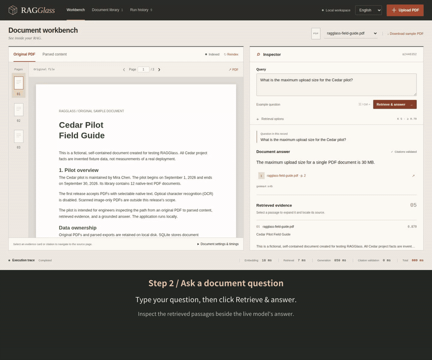

# Follow a PDF table answer back to its source

**English** | [繁體中文](CASE_STUDY.zh-TW.md)

A PDF RAG answer can sound plausible while leaving its source unclear. This walkthrough shows how to inspect one answer through retrieved evidence to the original table, then check a question that the same document cannot answer. It uses **the fictional Cedar pilot**, an original three-page CC0 fixture; its limits and costs are not facts about a real service.

[Watch the recorded live-model walkthrough](../README.md#watch-the-demo) · [Run it yourself](USAGE.md) · [Capture receipt](media/demo-recording.json)

## The question and the source

Upload [ragglass-field-guide.pdf](../examples/ragglass-field-guide.pdf), wait for **Indexed**, then ask:

> What is the maximum upload size for the Cedar pilot?

In the recorded execution, real `gemma4:e4b` inference returned:

> The maximum upload size is 30 MB per PDF document.

The backend checked the answer's citation ID against this query's retrieved IDs and mapped it to the uploaded file and page 2. Click the source button to open that page. The original table's **Maximum upload size** row shows **30 MB**, with **Per PDF document** in its meaning column. Source item boxes are highlighted where Docling supplied coordinates.

The cited chunk ID was `cc11238c-83ad-52c7-8e55-e2eb3454b43b`, and the document SHA-256 was `878bfa94da33d16c947f174d12560e3f7b4efa807cbd0b189f0841af7db58d8a`. These identify the recorded source. A new workspace will have its own document/chunk IDs; compare source text, hash, and page rather than expecting IDs to stay identical across uploads.

Open **Parsed content** to check that the table row survived Docling parsing. Select a retrieved passage to inspect its full text, score, chunk ID, source pages, and available coordinates. This lets you check whether a missing answer is associated with parsing or evidence selection before changing the answer model.

## Check an unsupported question too

Ask:

> What is the pilot's annual electricity cost in dollars?

The document deliberately omits that information. In the recording the model returned an unanswerable result, and the validated application response was:

> The answer cannot be confirmed from the retrieved document evidence.

It displayed **no citation buttons**. Retrieval can still return related passages; a high similarity score does not supply the missing fact. This is one observed refusal, not proof that every unsupported or adversarial question will be handled correctly.

## Keep the execution inspectable

Expand **Run settings & prompt** and inspect the actual generation/retrieval configuration. The recorded supported query used `gemma4:e4b`, temperature 0, thinking disabled, top K 5, and minimum cosine score 0.70. Download the run JSON or reopen it from **Run history** to inspect the question, exact prompt, evidence, answer, citations, model metadata, configuration, and timings.

The following are wall-clock stage measurements from the recording on **2026-10-03 UTC**, not a model ranking or a production latency promise:

| Stage | Table question | Unsupported question |
| --- | ---: | ---: |
| Query embedding | 16.99 ms | 14.08 ms |
| Qdrant retrieval | 10.02 ms | 5.35 ms |
| Model generation | 5,146.67 ms | 876.19 ms |
| Citation validation | 0.09 ms | 0.05 ms |
| Total query | 5,177.93 ms | 898.10 ms |

For the table question, Ollama reported **4,626.75 ms of model loading** inside its generation request. The timing includes that load; it is not a warm-model-only measurement. Ollama duration fields in the receipt are nanoseconds, while application stage timings are milliseconds.

The recorded workspace reused an existing index. No fresh ingestion duration or isolated GPU measurement is claimed for this video. Initial downloads/model loading and other shared workloads can change timings. The [milestone record](MILESTONE.md) contains the earlier full-stack measurements and host context.

## Reproduce and interpret

Follow the [deployment guide](DEPLOYMENT.md), start the real stack, upload the fixture, and try both questions. Run `.venv/bin/python scripts/verify_e2e.py` for all six documented smoke-test questions. The [sharing guide](LAUNCH.md) explains how to reproduce the recording without including private workspace data.

Source-ID validation establishes **retrieved-source membership and file/page mapping**. It does not prove that the answer's claims are entailed by the passage. Docling boxes locate source items, not exact phrase spans. The current parser supports native-text PDFs; this example does not validate OCR, large corpora, alternate answer models, or a broad faithfulness benchmark.

When reporting a problem, include the version, a public/sanitized PDF, the question, expected source page, observed answer/evidence, and relevant settings. Do not upload private documents or credentials. Those concrete reports help choose the next parsing, retrieval, or evaluation improvement.
