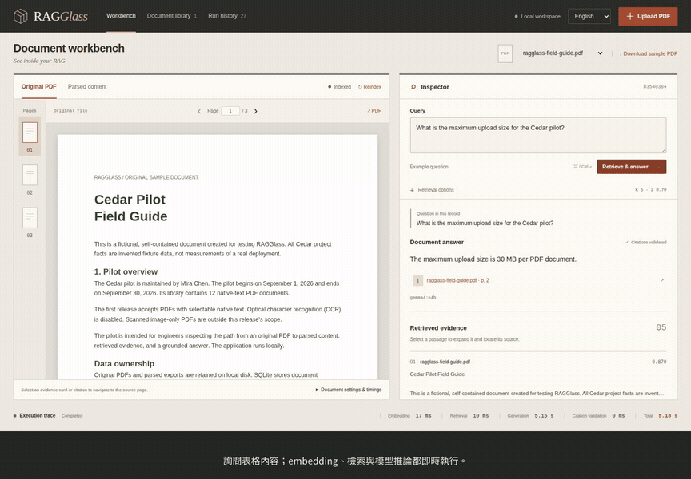

# 從 PDF 表格答案追查原始來源

[English](CASE_STUDY.md) | **繁體中文**

PDF RAG 回答可能看似合理，但來源不清楚。本案例從一個答案，沿著檢索證據回到原始表格，再檢查相同文件無法回答的問題。使用**虛構 Cedar 試用方案**的原創三頁 CC0 範例，裡面的限制與成本不是現實服務資料。

[觀看真實模型操作影片，繁體中文字幕](https://github.com/KuoFengYuan/RAGGlass/releases/download/v0.1.0/ragglass-demo.zh-TW.mp4) · [自行操作](USAGE.zh-TW.md) · [錄製來源紀錄](media/demo-recording.json)

## 問題與原始證據

上傳[ragglass-field-guide.pdf](../examples/ragglass-field-guide.pdf)，等待**已索引**，再詢問：

> What is the maximum upload size for the Cedar pilot?

意思是「Cedar 試用方案的上傳容量上限是多少？」錄製當下使用真實 `gemma4:e4b`，回傳：

> The maximum upload size is 30 MB per PDF document.

即「每份 PDF 文件最大上傳容量為 30 MB」。後端確認引用 ID 屬於本次檢索結果，再映射到已上傳文件與第 2 頁。點來源按鈕回到原始頁面：表格 **Maximum upload size** 一列為 **30 MB**，意義欄為 **Per PDF document**。Docling 提供座標的來源項目會顯示框線。

該次引用片段 ID 為 `cc11238c-83ad-52c7-8e55-e2eb3454b43b`，文件 SHA-256 為 `878bfa94da33d16c947f174d12560e3f7b4efa807cbd0b189f0841af7db58d8a`。這些識別該次錄製來源；新工作區會有自己的文件／片段 ID，應對照原文、hash 與頁碼，不假設不同上傳有相同 ID。

開啟**解析內容**，確認表格列有保留在 Docling 結果；選取檢索片段，查看全文、分數、chunk ID、來源頁與座標。這能協助先檢查解析與證據選取，再決定是否更換回答模型。

## 也檢查文件無法回答的問題

詢問：

> What is the pilot's annual electricity cost in dollars?

意思是「試用方案年度電費是多少美元？」文件刻意沒有提供此資訊。錄製時模型回傳不可回答的結果，應用驗證後顯示：

> The answer cannot be confirmed from the retrieved document evidence.

即「無法從本次檢索的文件證據確認答案」，且**不顯示引用按鈕**。檢索仍可能找到相關片段，較高相似度不代表有缺少的事實。這只是一次實際拒答，不保證所有無證據或對抗問題都能正確處理。

## 保留可檢查的執行內容

展開**執行設定與 prompt**，查看實際模型／檢索設定。錄製的可回答問題使用 `gemma4:e4b`、temperature 0、關閉 thinking、top K 5、最低 cosine 分數 0.70。可下載 JSON 或從**歷史紀錄**重新開啟，檢查問題、完整 prompt、證據、答案、引用、模型 metadata、設定與耗時。

以下為錄製當下 **2026-10-03 UTC** 的 wall-clock 階段實測，並非模型排名或正式服務延遲保證：

| 階段 | 表格問題 | 無法回答的問題 |
| --- | ---: | ---: |
| 問題 embedding | 16.99 ms | 14.08 ms |
| Qdrant 檢索 | 10.02 ms | 5.35 ms |
| 模型生成 | 5,146.67 ms | 876.19 ms |
| 引用驗證 | 0.09 ms | 0.05 ms |
| 查詢總計 | 5,177.93 ms | 898.10 ms |

表格問題的 Ollama 回報**模型載入耗時 4,626.75 ms**，包含在生成請求中，並非只有已載入模型的推論時間。來源紀錄的 Ollama duration 欄位為奈秒，應用階段耗時則為毫秒。

錄製重用工作區已存在的索引，本影片沒有宣稱重新解析／索引耗時或獨立 GPU 測量。首次下載、模型載入與其他共用工作負載都可能改變耗時；先前完整流程與硬體實測見[里程碑](MILESTONE.zh-TW.md)。

## 重現與判讀

依[部署指南](DEPLOYMENT.zh-TW.md)啟動真實服務，上傳範例，詢問這兩題。使用 `.venv/bin/python scripts/verify_e2e.py` 執行完整六題 smoke test；[分享指南](LAUNCH.zh-TW.md)說明如何重製影片並排除私人工作區資料。

來源 ID 驗證能確認**引用屬於本次檢索，以及文件／頁碼映射**，無法證明片段語意支持答案中的每個主張。Docling 框線對應來源項目，不是精確詞句範圍。此版本解析原生文字 PDF，本案例不驗證 OCR、大型文件庫、其他回答模型或廣泛忠實度。

回報問題時附上版本、公開／去識別 PDF、問題、預期來源頁、實際答案／證據及相關設定，不上傳私人文件或憑證。具體重現資料能協助選擇下一個解析、檢索或評測改善。
