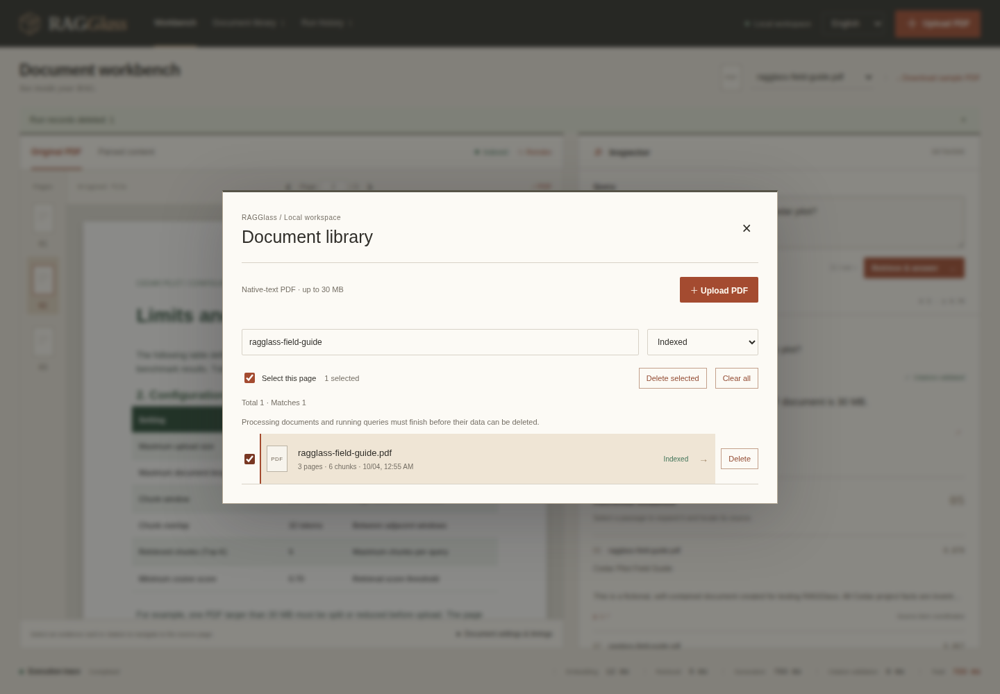
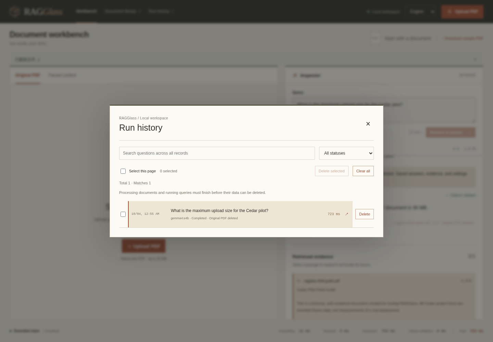

# Manage documents and run history

**English** | [繁體中文](CLEANUP.zh-TW.md)

Open **Document library** or **Run history** in the top navigation. Each catalog supports search, status filtering, single-item deletion, checkbox selection, and **Clear all**. A confirmation shows the count and effects; Cancel is focused first. Deletion is permanent.

## Remove PDFs



1. Open **Document library**. Search a filename or choose a status, such as **Indexed**, **Failed**, or **Cleanup incomplete**.
2. Click **Delete** beside a file, or select checkboxes and click **Delete selected**. **Select this page** selects the visible items that can be deleted.
3. Read the confirmation. It removes the original PDF, Markdown/Docling JSON, SQLite chunks/document metadata, and that document's vectors in every `ragglass_` collection, including old embedding revisions.
4. Click **Delete permanently**. The catalog updates and reports how many files were deleted. The workbench resets a removed PDF view; another available document can be selected.

**Clear all** includes documents hidden by search/status filters. Saved runs remain: they can still contain document text in evidence, prompts, and model answers. Remove run history separately if you want to remove that content too.

Historical answers/evidence/settings remain readable after their PDF is removed. Missing originals are labeled **Original PDF deleted** and their page links are disabled. Re-uploading the same bytes creates a new document ID; older citations remain attached to their original ID.

## Remove execution records



1. Open **Run history**. Search the question or filter **Completed**, **Failed**, or **Running**.
2. Click a row to reopen its saved answer, evidence, settings, and timings. History is paginated in groups of 50; search applies to the entire saved history.
3. Click a row's **Delete**, select records and **Delete selected**, or use **Clear all**.
4. Confirm **Delete permanently**. This removes the saved question, answer, evidence, prompt/raw completion, settings, and timings. PDFs, parsed chunks, and vector indexes remain.

**Clear all** covers the entire history, including older pages and filtered-out records. The number in the top navigation is the actual total, not the first page's size. Removing the currently displayed record clears its result and preserves the text in the question editor. Cleared items stay removed after API restart.

## Busy data and failures

- Documents being ingested or used by a query, and running records, are protected. Wait for completion and retry. The API returns HTTP 409 for busy selections; the UI explains the action.
- If the count changes while an **all** confirmation is open, the backend rejects that request. Close the confirmation, refresh, and confirm again.
- Vector deletion is confirmed before local PDF data is removed. If Qdrant is unavailable, local data remains with **Cleanup incomplete**; start Qdrant, verify `QDRANT_URL`, and retry deletion. **Reindex** can restore the document if you choose to keep it.
- A batch can partially succeed if a vector or filesystem operation fails. Actual deleted IDs and errors are returned; only successful deletions are reported. Failed items remain visible for retry. A filesystem failure can leave partially removed artifacts; inspect storage permissions and backend logs.
- Use **one API worker/process per data directory**. Coordination is process-local; several API instances sharing the same SQLite/files directory are unsupported.

This is logical application cleanup, not secure disk erasure. SQLite/WAL files may retain freed pages and may not shrink immediately. Backups, downloaded originals/run JSON, model caches, and external model-service storage are outside the cleanup scope. Qdrant collections and its Docker volume remain available.

## API and reproducible verification

The API exposes `DELETE /api/documents/{id}` and `DELETE /api/runs/{id}` for one item; `POST /api/documents/cleanup` and `POST /api/runs/cleanup` accept a selection or all items:

```json
{"ids": ["an-existing-id", "another-existing-id"]}
```

```json
{"all": true, "expected_count": 126}
```

Supply exactly one scope. For all items, use the current total: documents come from `/api/documents`; history totals come from `/api/runs/catalog`. A cleanup result contains `kind`, `deleted_ids`, and `failures`. Check `failures` even if the response is HTTP 200. The history catalog accepts `search`, `status`, `offset`, and `limit`; the older `/api/runs` list defaults to 100 records and is not a total-count endpoint.

Run meaningful verification with real Qdrant and the configured model HTTP service available:

```bash
bash scripts/check.sh
.venv/bin/python scripts/verify_cleanup.py --browser
```

The second command starts and stops an owned disposable loopback API, uses real Docling/E5/Qdrant/model inference, checks files/vectors/history and API restarts, and runs Chrome against the built UI. It verifies the owner's existing documents/runs/vectors remain unchanged. It removes only test-created vectors/collections; results and logs are ignored under `.data/cleanup-*`. Build first if the frontend changed. The destructive browser test is skipped during normal `test:e2e`; this verifier enables it only for its disposable server. Four cleanup screenshots are actual public-fixture UI captures from that test, not mockups.

For installation and data backup, see [deployment](DEPLOYMENT.md). Return to [usage](USAGE.md) or the [README](../README.md).
