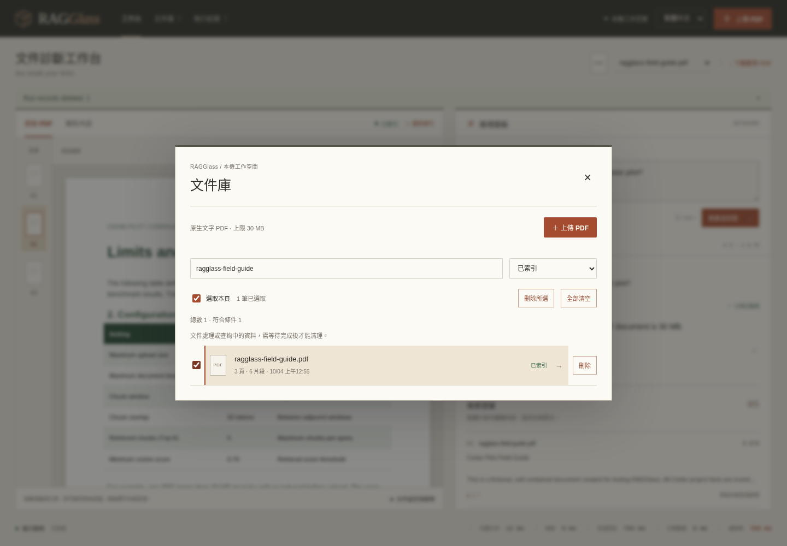
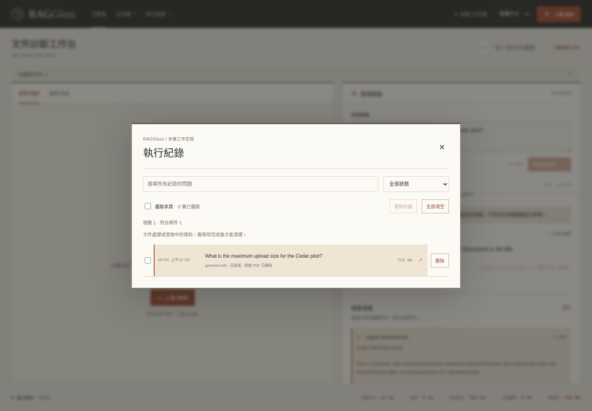

# 管理文件與執行紀錄

[English](CLEANUP.md) | **繁體中文**

從上方導覽開啟**文件庫**或**執行紀錄**。兩個列表均支援搜尋、狀態篩選、單筆刪除、勾選刪除與**全部清空**。確認視窗顯示筆數及影響，預設焦點在「取消」。刪除後無法復原。

## 清理 PDF



1. 開啟**文件庫**。搜尋檔名，或篩選**已索引**、**失敗**、**清理未完成**等狀態。
2. 點文件旁的**刪除**，或勾選後點**刪除所選**。**選取本頁**會勾選目前可見且可刪除的項目。
3. 閱讀確認內容：將移除原始 PDF、Markdown／Docling JSON、SQLite 文件與片段，以及所有 `ragglass_` collection 中該文件的向量，涵蓋舊 embedding 版本。
4. 點**永久刪除**。列表會更新並顯示實際刪除數；工作台會重設已移除的 PDF 畫面，可另選仍存在的文件。

**全部清空**包含被搜尋與狀態條件隱藏的文件。執行紀錄仍保留，證據、Prompt 與答案可能包含文件文字；若也要移除這些內容，請另外清理執行紀錄。

刪除 PDF 後，歷史答案、證據與設定仍可閱讀。介面標示**原始 PDF 已刪除**並停用對應頁面連結。重新上傳相同檔案會建立新文件 ID，舊引用仍保留原始 ID，不會自動重新對應。

## 清理執行紀錄



1. 開啟**執行紀錄**。搜尋問題，或篩選**已完成**、**失敗**、**執行中**。
2. 點列可重新查看答案、證據、設定與耗時。每頁顯示 50 筆，搜尋會查詢全部歷史紀錄。
3. 點單筆的**刪除**，或勾選後點**刪除所選**，也可使用**全部清空**。
4. 確認**永久刪除**。這會移除保存的問題、答案、證據、Prompt／原始模型回覆、設定與耗時；PDF、解析片段及向量索引仍保留。

**全部清空**會清理整份歷史，包括其他頁及被篩選隱藏的紀錄。上方導覽顯示真實總數，而非第一頁筆數。刪除正在檢視的紀錄後，結果會清空，問題輸入框的文字保留。API 重啟後，已清理項目仍維持刪除。

## 處理中與清理失敗

- 正在解析／索引或被查詢使用的文件，以及執行中的紀錄會受保護，請等待完成再重試。API 對忙碌的選取資料回傳 HTTP 409，介面顯示處理方式。
- 「全部」確認視窗開啟後若筆數改變，後端會拒絕該請求。請關閉視窗、重新整理後再次確認。
- 先確認向量刪除完成，才移除本機 PDF。Qdrant 無法連線時，本機資料以**清理未完成**狀態保留；啟動 Qdrant、檢查 `QDRANT_URL` 後重試。若決定保留文件，可按**重新索引**恢復。
- 向量或檔案操作失敗時，批次清理可能只完成部分項目。後端回傳實際刪除 ID 與錯誤，畫面只報告成功刪除數，其餘項目保留供重試。檔案系統錯誤可能造成部分解析檔案已移除，請檢查目錄權限與後端日誌。
- 每個資料目錄請只啟動**一個 API worker／process**。清理協調機制位於單一程序，多個 API 共用同一 SQLite／檔案目錄不受支援。

這是應用層的邏輯清理，不是磁碟安全抹除。SQLite／WAL 可能保留已釋放的頁面，檔案大小也不一定立即縮小。備份、下載過的 PDF／執行 JSON、模型快取與外部模型服務的儲存內容不在清理範圍；Qdrant collection 與 Docker volume 仍保留。

## API 與重現驗證

單筆可用 `DELETE /api/documents/{id}`、`DELETE /api/runs/{id}`；`POST /api/documents/cleanup`、`POST /api/runs/cleanup` 可指定所選或全部：

```json
{"ids": ["an-existing-id", "another-existing-id"]}
```

```json
{"all": true, "expected_count": 126}
```

只能擇一指定範圍。清理全部時使用目前總數：文件來自 `/api/documents`，紀錄總數來自 `/api/runs/catalog`。結果包含 `kind`、`deleted_ids`、`failures`，即使 HTTP 200 也須檢查 `failures`。歷史 catalog 支援 `search`、`status`、`offset`、`limit`；原本的 `/api/runs` 預設只回傳 100 筆，不是總數查詢。

真實 Qdrant 與已設定的模型 HTTP 服務運行時，可執行有意義的驗證：

```bash
bash scripts/check.sh
.venv/bin/python scripts/verify_cleanup.py --browser
```

第二個指令會自行啟停專用的暫存 loopback API，使用真實 Docling／E5／Qdrant／模型推論，檢查檔案、向量、歷史與 API 重啟，並用 Chrome 測試建置介面。它會驗證原工作空間的文件、紀錄與向量未改動，只移除測試建立的向量與 collection；結果和日誌放在忽略的 `.data/cleanup-*`。前端變更後須先 build。一般 `test:e2e` 會跳過具刪除效果的測試，只有此驗證器會為專用暫存服務開啟。四張清理功能圖片是測試時擷取的公開範例實際畫面，不是示意圖。

安裝與備份請見[部署指南](DEPLOYMENT.zh-TW.md)。返回[使用指南](USAGE.zh-TW.md)或 [README](../README.zh-TW.md)。
