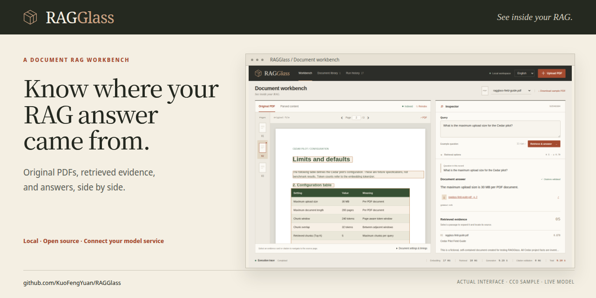

# Sharing RAGGlass

**English** | [繁體中文](LAUNCH.zh-TW.md)

Explain one concrete benefit: **inspect a PDF RAG answer beside its retrieved evidence and original source page.** Lead with the question an engineer is trying to debug, then show the actual workflow. The current release supports inspection; automated diagnosis and before/after evaluations are future work.

## Ready-to-use materials

| Material | Where to find it | How to use it |
| --- | --- | --- |
| Full demo in the README | [Watch here](../README.md#watch-the-demo) | Play, pause, or seek the 54.8-second recording on GitHub without downloading a file. |
| Live workflow video, English captions | [MP4](https://github.com/KuoFengYuan/RAGGlass/releases/download/v0.1.0/ragglass-demo.mp4) | Attach the video to your technical post. It includes a supported question, source navigation, settings, refusal, and history. |
| Subtitle files | [VTT](https://github.com/KuoFengYuan/RAGGlass/releases/download/v0.1.0/ragglass-demo.vtt) / [SRT](https://github.com/KuoFengYuan/RAGGlass/releases/download/v0.1.0/ragglass-demo.srt) | Reuse or edit captions in your video platform. The MP4 already contains visible English captions. |
| Short animated excerpt | [Actual citation interaction](images/demo.gif) | Embed in a post that accepts GIFs; this is a ten-second excerpt at normal speed. |
| Share cover | [1280 × 640 PNG](images/social-preview.png) | Use as a post cover or the GitHub Social preview image. |
| Post drafts | [Announcements](ANNOUNCEMENT.md) | Choose the short post, longer post, or Show HN draft; personalize the author's experience before posting. |
| Technical article | [Trace a PDF table answer to its source](CASE_STUDY.md) | Share a reproducible example with clear scope and limits. |
| Release information | [v0.1.0 notes](RELEASE-v0.1.0.md) | Link users to a specific, tested source version. |
| Recording receipt | [Public capture metadata](media/demo-recording.json) | Check the fixture hash, model, source commit, actual answers, citations, and measured timings. |



The video is a **recorded demonstration of live inference**, not a hosted interactive service. It uses the original fictional CC0 fixture and reuses the index already present in the recorded workspace. Captions are added below the UI, initial navigation is trimmed, and the interaction plays at normal speed. Public answers in the receipt document that recording; the application still performs real queries when you run it.

## Configure GitHub sharing

The repository already has an English description, relevant Topics, a license, bilingual documentation, and real screenshots. Keep the profile and About text consistent with the one-sentence purpose. Pin RAGGlass on your profile if it is one of the projects you want visitors to try.

Set the link preview through the [repository settings](https://github.com/KuoFengYuan/RAGGlass/settings): **Settings → Social preview → Edit → Upload an image**, then choose `docs/images/social-preview.png`. Adding a PNG to Git does **not** set this GitHub property. GitHub's documented UI is the supported upload path; no settings upload is performed by the rendering script. GitHub recommends 1280 × 640 pixels and an image under 1 MB. [GitHub social preview documentation](https://docs.github.com/en/repositories/managing-your-repositorys-settings-and-features/customizing-your-repository/customizing-your-repositorys-social-media-preview)

## First week

| When | Action | Useful outcome to observe |
| --- | --- | --- |
| Day 1 | Watch the video, check the release and installation links, set the Social preview image, and record a baseline. | A reader can understand the workflow and find the setup without asking you. |
| Day 2 | Share one personalized technical post with the video on LinkedIn or X and in a community where you already participate. | Questions from engineers building PDF RAG; actual installation attempts. |
| Days 3–4 | Publish the table/citation case study; answer setup and model-service questions and turn reproducible problems into issues. | Useful feedback with a sample, question, observed behavior, and version. |
| Day 5 | Consider Show HN when you can explain the implementation and be available for discussion. Link the runnable repository. | People can clone and try the work themselves. |
| Day 7 | Record another traffic snapshot, review issues, and choose one concrete improvement. | Which sources bring visitors, clones, and actionable feedback. |

This is a proposed schedule, not a scheduled automation. No social posts, community submissions, or invitations are sent by these scripts. The author should publish and participate personally.

Show HN asks for something people can try, an explanation of why/how you made it, and low barriers to use. It also disallows asking friends to upvote/comment. Use the [Show HN guidelines](https://news.ycombinator.com/showhn.html) when adapting the draft. The checked [r/LocalLLaMA rules](https://www.reddit.com/r/LocalLLaMA/about/rules.json) restrict self-promotion and primarily LLM-generated copy/code; that community is not a default destination for these drafts. Review current rules before any community submission.

## Weekly technical topics

Start with the existing [table/source case study](CASE_STUDY.md). Follow with how chunk/page metadata survives parsing, how an unreachable model is shown in a saved run, or why citation membership does not prove claim entailment. A model comparison can be published **after** measuring the same documents/questions/configuration for each candidate. Label smoke tests, fictional documents, untested models, and other workloads accurately.

Invite readers to try the public fixture or report a sanitized reproduction. A useful closing line is: “If this helps your RAG work, a star helps other engineers discover it.” For Show HN, invite technical feedback without an upvote request. Repeated posting and popularity claims are not part of this plan.

## Measure results

GitHub CLI must be authenticated with access to the repository. Traffic endpoints require push access. Run this before a post and again each week:

```bash
.venv/bin/python scripts/record_traffic.py --note "Before the first technical post"
# For your fork or another repository you own:
.venv/bin/python scripts/record_traffic.py --repo OWNER/REPOSITORY --note "Weekly review"
```

The helper reads GitHub and writes a timestamped JSON snapshot under ignored `.data/traffic/`. It records current stars/forks/issues, 14-day views and full clones, daily buckets, referring sites, popular paths, and your local note. It performs no repository mutations or posting. Unavailable measurements remain null with a reported error, rather than becoming zero.

Traffic totals are moving 14-day windows: **do not add overlapping snapshot totals together**. Compare matching daily buckets and changes in star totals. Visits can include your own checks; a visit cannot be assumed to represent a successful installation. GitHub does not report complete acquisition attribution. Use installation reports and useful issues alongside stars. GitHub documents visitor/clone updates hourly, referrers/popular content daily, and UTC reporting. [GitHub traffic documentation](https://docs.github.com/en/repositories/viewing-activity-and-data-for-your-repository/viewing-traffic-to-a-repository)

## Reproduce the media

Use the [deployment guide](DEPLOYMENT.md) to start the real stack. A public recording workspace must contain only the public fixture, its original filename, and sample questions. The capture helper refuses private documents/questions, a history at the API's 500-record cap, and non-loopback application/model endpoints. It does not delete or hide existing data to make a recording pass. Keep private work in its own workspace; use a separate configured instance for public captures when necessary.

Chrome, FFmpeg with `libx264`/GIF support, and a local CJK font such as Noto Sans CJK TC are needed for rendering both subtitle languages. Chromium can be installed through the existing pinned Playwright package; downloads stay in the project:

```bash
PLAYWRIGHT_BROWSERS_PATH="$PWD/.cache/playwright" frontend/node_modules/.bin/playwright install ffmpeg
# Only if Chrome is unavailable:
PLAYWRIGHT_BROWSERS_PATH="$PWD/.cache/playwright" frontend/node_modules/.bin/playwright install chromium
export RAGGLASS_BROWSER=chromium
```

If Chrome is installed, omit the two Chromium lines. With the fixture-only service ready:

```bash
node scripts/capture_demo.mjs
node scripts/render_social_preview.mjs
```

`RAGGLASS_BASE_URL` defaults to `http://127.0.0.1:8000`. The video helper makes **two new live queries** and saves them in application history. It checks the 30 MB answer, retrieved citation membership, original page 2, available source boxes, parsed table, settings, insufficient-evidence refusal, history reopening, and browser errors. A recording over 60 seconds fails with an actionable retry message; it never accelerates inference to fit a target length.

MP4s, VTT/SRT, raw browser footage, subtitle source, and the full local recording receipt are written to ignored `.data/launch/`. The English/Traditional Chinese GIFs, poster, bilingual covers, and public recording receipt are repository assets. Re-rendering a cover does not make model calls. Inspect the assets before committing; publish the MP4 and subtitle files as release attachments rather than adding raw footage/build caches to Git.

## Keep the README demo playable

Each README embeds its complete captioned recording with GitHub's native video player. The stable public attachment URLs and file hashes are in [demo-embeds.json](media/demo-embeds.json); the original recording's inference evidence remains in [demo-recording.json](media/demo-recording.json). The English and Chinese MP4 attachments were checked byte-for-byte against the actual recording. GitHub renders the player; a local Markdown viewer may display the URL instead.

To replace a recording, review the new public footage first, then attach both videos to the relevant PR with **GitHub CLI 2.99+** (`--attach`; verified with 2.102.0):

```bash
gh pr edit YOUR_PR_NUMBER --attach .data/launch/ragglass-demo.mp4 --attach .data/launch/ragglass-demo.zh-TW.mp4
```

Copy each resulting `https://github.com/user-attachments/assets/...` URL into its language's README as the only content in its paragraph. Update the attachment manifest with the new URLs, filenames, byte sizes, SHA-256 hashes, and source PR. Keep “Watch the demo” linked to the README section. GitHub's [attachment guide](https://docs.github.com/en/github-cli/github-cli/attaching-files-with-github-cli) describes uploading and inline rendering.

After pushing the task branch, verify the actual anonymous GitHub page, playback, seek, dimensions, duration, and absence of MP4 download links:

```bash
RAGGLASS_GITHUB_REF=YOUR_PUSHED_COMMIT node scripts/check_readme_demo.mjs
# Recheck published main after merging:
node scripts/check_readme_demo.mjs
```

This check uses the project's locked Playwright and Chrome/Chromium setup described above. Results and player screenshots are saved under ignored `.data/launch/`. It reads GitHub and plays recorded media; it does not send model queries or change repository content. `scripts/check.sh` checks the bilingual embed structure offline; the browser check needs network access and the pushed README.

Repository publication and media reproduction do not guarantee a particular visitor or star count. The weekly snapshots document observed outcomes.
