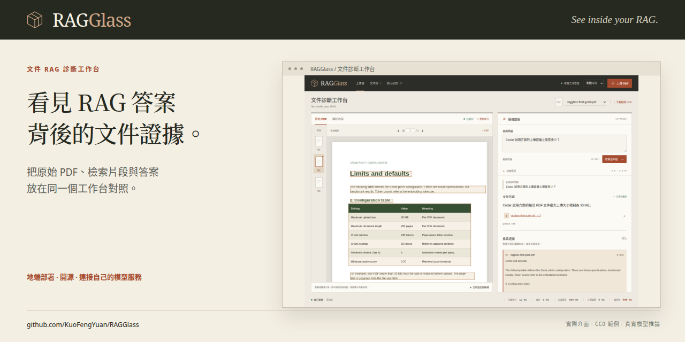

# 分享 RAGGlass

[English](LAUNCH.md) | **繁體中文**

先說清楚一個具體用途：**把 PDF RAG 答案、檢索證據與原始來源頁面放在一起檢查。** 從工程師正在追查的問題切入，再展示實際流程。目前提供人工檢視；自動診斷與修改前後評測仍屬後續功能。

## 可直接使用的素材

| 素材 | 位置 | 用法 |
| --- | --- | --- |
| README 完整示範 | [直接觀看](../README.zh-TW.md#觀看操作示範) | 在 GitHub 頁內播放、暫停或拖曳 54.8 秒實錄，無須下載檔案。 |
| 真實流程短片，繁體中文字幕 | [MP4](https://github.com/user-attachments/assets/a361e0f0-72f0-41f4-9ebc-93655a0a91b7) | 附在技術貼文，展示可回答問題、來源跳頁、設定、拒答與歷史；介面為英文，字幕為繁體中文。 |
| 教學字幕檔 | [VTT](media/ragglass-demo.zh-TW.vtt)／[SRT](media/ragglass-demo.zh-TW.srt) | 重用目前的步驟標題、操作與提示，內容已嵌入教學影片。 |
| 教學文字 | [七步操作說明](DEMO.zh-TW.md) | 依約略時間與按鈕名稱，搭配影片練習。 |
| 動畫片段 | [實際引用操作](images/demo.zh-TW.gif) | 用於支援 GIF 的貼文；為繁體中文字幕、正常速度的十秒節錄，介面為英文。 |
| 分享封面 | [1280 × 640 PNG](images/social-preview.zh-TW.png) | 可用於貼文封面或 GitHub Social preview。 |
| 貼文草稿 | [發布文案](ANNOUNCEMENT.zh-TW.md) | 選擇短文、長文或 Show HN 版本；發布前補上作者自己的開發經驗。 |
| 技術案例 | [追查 PDF 表格答案的原始來源](CASE_STUDY.zh-TW.md) | 分享可重現的例子，說明範圍與限制。 |
| 版本說明 | [v0.1.0 說明](RELEASE-v0.1.0.zh-TW.md) | 引導使用者取得明確、已驗證的來源版本。 |
| 錄製來源紀錄 | [公開錄製 metadata](media/demo-recording.json) | 查看範例 hash、模型、來源提交、實際答案、引用與實測耗時。 |



影片是**錄製當下使用真實推論的操作示範**，並非託管的互動服務。使用原創虛構 CC0 範例，重用該工作區已存在的索引。字幕加在介面下方，裁掉開始前的導覽，操作維持正常速度。來源紀錄中的公開答案只描述該次錄製；實際啟動應用後仍會執行新的真實查詢。

## 設定 GitHub 分享呈現

儲存庫已有英文用途描述、相關 Topics、授權、雙語文件與實際截圖。個人簡介與 About 可維持同一句用途；若 RAGGlass 是你希望訪客試用的代表作，可釘選到 GitHub 個人頁。

連結預覽圖須由[儲存庫設定](https://github.com/KuoFengYuan/RAGGlass/settings)上傳：**Settings → Social preview → Edit → Upload an image**，選擇英文主封面 `docs/images/social-preview.png`；繁體中文貼文可用 `docs/images/social-preview.zh-TW.png`。Git 中有 PNG **不等於** GitHub 已套用此設定。GitHub 官方文件提供的是這個 UI 上傳流程，產圖腳本不會執行設定上傳。GitHub 建議 1280 × 640、低於 1 MB。[GitHub 社群預覽文件](https://docs.github.com/en/repositories/managing-your-repositorys-settings-and-features/customizing-your-repository/customizing-your-repositorys-social-media-preview)

## 第一週

| 時間 | 行動 | 觀察的結果 |
| --- | --- | --- |
| 第 1 天 | 看完影片，確認版本與安裝連結，設定 Social preview，保存流量基準。 | 讀者能理解流程，並自行找到啟動方式。 |
| 第 2 天 | 在 LinkedIn／X 及平常參與的技術社群分享一篇個人化貼文與影片。 | PDF RAG 工程師提出問題、實際嘗試安裝。 |
| 第 3–4 天 | 分享表格／引用案例，回答環境與模型問題，把可重現錯誤整理為 issue。 | 收到包含範例、問題、實際行為及版本的回饋。 |
| 第 5 天 | 能說明實作並有空參與討論時，再考慮 Show HN，連到可執行的儲存庫。 | 讀者能 clone 並自行試用。 |
| 第 7 天 | 保存新流量快照、檢查 issue，選一個具體改善項目。 | 了解哪些來源帶来訪客、clone 與可處理的回饋。 |

這是建議時程，沒有建立排程。腳本不會發送社群貼文、社群投稿或邀請；由作者親自發布與參與討論。

Show HN 要求作品可試用，能說明為何及如何開發，並降低使用門檻；也禁止請朋友協助投票／留言。調整草稿時請依[Show HN 規則](https://news.ycombinator.com/showhn.html)。本次查閱的[r/LocalLLaMA 規則](https://www.reddit.com/r/LocalLLaMA/about/rules.json)限制自我宣傳及主要由 LLM 產生的文案／程式，並非這些草稿的預設投稿目標。實際投稿前查看當時社群規則。

## 每週技術主題

先使用現有[表格與來源案例](CASE_STUDY.zh-TW.md)，再分享頁碼／片段 metadata 如何保留、模型不可連線如何保存成失敗紀錄，或為何引用合法不代表答案語意正確。模型比較應在各候選都使用相同文件、問題與設定**完成實測之後**發布。正確標示 smoke test、虛構文件、未驗證模型與其他硬體工作負載。

邀請讀者用公開範例試用或回報去識別的重現資料。可用結尾：「如果對你的 RAG 工作有幫助，歡迎 Star，讓其他工程師找到它。」Show HN 則邀請技術回饋，不要求投票。本計畫不包含重複洗版或未經驗證的熱門程度宣稱。

## 觀察成果

GitHub CLI 必須登入並有該儲存庫的存取權；流量 API 需要 push 權限。發布前及每週執行：

```bash
.venv/bin/python scripts/record_traffic.py --note "Before the first technical post"
# 自己的 fork 或其他擁有的儲存庫：
.venv/bin/python scripts/record_traffic.py --repo OWNER/REPOSITORY --note "Weekly review"
```

工具唯讀取得 GitHub 資料，寫入已忽略的 `.data/traffic/`，每份 JSON 有時間戳。保存當下 Star／fork／issue、14 天瀏覽／完整 clone、每日資料、來源網站、熱門路徑與本機備註，不修改儲存庫或發文。無法取得的數值保留 null 並回報錯誤，不會當成 0。

流量總數是移動的 14 天視窗，**不可把重疊快照總量相加**；應比較相同每日資料及 Star 總數變化。自己的檢查也可能帶來瀏覽，訪客不代表成功安裝。GitHub 不提供完整獲客歸因；除了 Star，也看實際安裝回報與可處理的 issue。官方說明訪客／clone 每小時更新、來源／熱門內容每日更新、使用 UTC。[GitHub 流量文件](https://docs.github.com/en/repositories/viewing-activity-and-data-for-your-repository/viewing-traffic-to-a-repository)

## 重現影片與封面

依[部署指南](DEPLOYMENT.zh-TW.md)啟動真實服務。公開錄製工作區只能包含公開範例、原檔名與測試問題。工具會拒絕私人文件／問題、已達 API 500 筆上限的歷史，以及非 loopback 的應用／模型端點。不會刪除或隱藏既有資料以通過錄製檢查；私人工作保留在自己的工作區，需要時另外設定公開錄製服務。

兩種字幕輸出需要 Chrome、支援 `libx264`／GIF 的 FFmpeg，以及 Noto Sans CJK TC 等本機中文字型。可用已鎖定的 Playwright 套件安裝 Chromium，下載保存在專案：

```bash
PLAYWRIGHT_BROWSERS_PATH="$PWD/.cache/playwright" frontend/node_modules/.bin/playwright install ffmpeg
# 缺少 Chrome 才需要：
PLAYWRIGHT_BROWSERS_PATH="$PWD/.cache/playwright" frontend/node_modules/.bin/playwright install chromium
export RAGGLASS_BROWSER=chromium
```

已安裝 Chrome 時略過 Chromium 的兩行。確認工作區只有公開範例後執行：

```bash
node scripts/capture_demo.mjs
node scripts/render_social_preview.mjs
```

`RAGGLASS_BASE_URL` 預設 `http://127.0.0.1:8000`。錄影工具會新增**兩次真實查詢**並保存到應用歷史，檢查 30 MB 答案、本次檢索引用、第 2 頁、來源座標框、解析表格、設定、無證據拒答、歷史重開與瀏覽器錯誤。超過 60 秒會失敗並提示重試，不會加速推論以符合目標片長。

MP4、原始瀏覽器影片、ASS 渲染檔與完整本機錄製紀錄寫入已忽略的 `.data/launch/`。中英文 GIF、影片海報、雙語封面、公開紀錄與可編輯的 VTT／SRT 教學文字作為專案素材。提交前檢查素材；影片二進位檔、原始錄影與建置快取不進 Git。v0.1.0 Release 保留原始預覽錄影，目前 README 使用教學字幕修訂版。

修改既有公開影片的字幕，先編輯[demo-tutorial.json](media/demo-tutorial.json)，再執行：

```bash
node scripts/render_demo.mjs
```

使用 `.data/launch/live-recording.webm` 搭配[demo-recording.json](media/demo-recording.json)，輸出兩支字幕影片與字幕檔、更新 GIF，並寫入[demo-tutorial-render.json](media/demo-tutorial-render.json)。**不新增模型查詢**，原始錄製紀錄保留。全新 clone 須先執行 `capture_demo.mjs` 產生原始影片，再執行 `render_demo.mjs` 更新重製紀錄後發布。檢查兩種語言的九個場景。每個畫面有步驟標題、操作指令與提示，置於獨立字幕區；字幕下方預留空間，避免在桌面 README 寬度下被原生播放器控制列遮住。[FFmpeg ASS filter](https://ffmpeg.org/ffmpeg-filters.html#ass)將文字嵌入影片，播放時不需要開啟字幕選項。

## 保持 README 影片可直接播放

兩份 README 都使用 GitHub 原生播放器嵌入完整操作教學。[demo-embeds.json](media/demo-embeds.json) 保存穩定公開附件網址與檔案雜湊；原始推論證據仍在[demo-recording.json](media/demo-recording.json)。中英 MP4 附件逐位元組確認與重製的教學影片相同。[重製紀錄](media/demo-tutorial-render.json)區分字幕修訂與新的模型執行。播放器由 GitHub 渲染，本機 Markdown 檢視器可能只顯示網址。

更新錄影時先檢查新的公開素材，再使用 **GitHub CLI 2.99+**（`--attach`，本次驗證 2.102.0）將兩支影片附在對應 PR：

```bash
gh pr edit YOUR_PR_NUMBER --attach .data/launch/ragglass-demo.mp4 --attach .data/launch/ragglass-demo.zh-TW.mp4
```

把產生的 `https://github.com/user-attachments/assets/...` 網址各自放入同語言 README，整個段落只保留網址。更新附件 metadata 的網址、檔名、位元組大小、SHA-256 與來源 PR。觀看入口保持連到 README 的示範章節。GitHub 的[附件指南](https://docs.github.com/en/github-cli/github-cli/attaching-files-with-github-cli)說明上傳與頁內播放方式。

推送任務分支後，驗證未登入的實際 GitHub 頁面、播放、跳轉、尺寸、片長及沒有 MP4 下載連結：

```bash
RAGGLASS_GITHUB_REF=YOUR_PUSHED_COMMIT node scripts/check_readme_demo.mjs
# 合併後再次驗證已發布的 main：
node scripts/check_readme_demo.mjs
```

使用專案已鎖定的 Playwright 及前述 Chrome／Chromium 環境。結果與播放器截圖寫入已忽略的 `.data/launch/`。工具讀取 GitHub 與播放實錄，不呼叫模型或修改儲存庫。`scripts/check.sh` 離線檢查雙語嵌入格式；瀏覽器檢查需要網路與已推送的 README。

發布與重現素材不保證特定訪客或 Star 數量；每週快照記錄實際成果。
