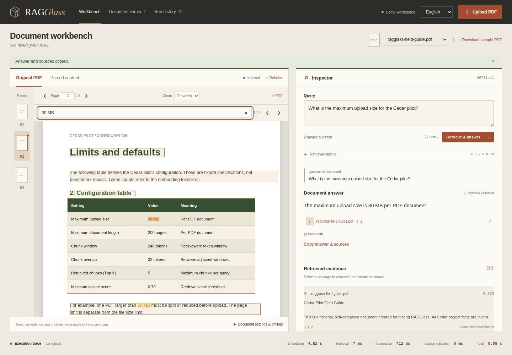

# Query controls, PDF reading, and answer exports

**English** | [繁體中文](USABILITY.zh-TW.md)

These tools help you follow a running query, check an answer against native PDF text, and reuse its result. For the complete workflow, see [illustrated usage](USAGE.md); for installation, see [deployment](DEPLOYMENT.md).

## Follow or stop a query

After **Retrieve & answer**, the query panel shows the current stage and elapsed seconds. Stages are question embedding, retrieval, generation, and citation validation. The elapsed counter is wall-clock time, not a predicted completion percentage. Retrieved evidence becomes available while the model is answering. An answer appears only after its response format and citation IDs pass validation.

Click **Stop query** to request cancellation. During embedding or vector retrieval, the current operation finishes before stopping; the app keeps the document and record protected from deletion until that operation ends. During generation, cancellation closes this query's model HTTP request. The separate model service controls whether and when its underlying inference stops; the app never stops a shared model process.

A stopped query becomes **Cancelled**, retaining its question, settings, prompt when available, retrieved evidence, and measured timings. It has no answer or citations. Find it with the **Cancelled** history filter. Submit a question again to create a new run. Reindexing the document is blocked while it is in use by a query.

Reloading the same browser tab reconnects to its active run, without submitting another query. A lost connection shows a reconnecting message and polling resumes. Closing the tab does not cancel the server's query; use **Stop query** first when that is your intent. Opening a running record from history also follows that run. Graceful API shutdown cancels active asynchronous queries; after an abrupt interruption, existing restart recovery marks unfinished records failed.

The interface uses `POST /api/query/start` to receive an execution record immediately, polls `GET /api/runs/{id}`, and sends `POST /api/runs/{id}/cancel` to stop. The existing synchronous `POST /api/query` remains compatible for scripts and cannot be cancelled through the new endpoint. Jobs belong to the single API worker; this is not a distributed job queue.

## Find and read the original PDF



Type a term in **Search this PDF…**. Search uses the PDF's native text across all pages, ignoring letter case, normalizing full-width variants, and ignoring whitespace between text items or lines. It does not search OCR, model answers, or Docling chunks. Image-only pages have no searchable native text.

| Control | Action |
| --- | --- |
| Search arrows / Enter / Shift+Enter | Move to the next/previous result, wrapping at the ends. |
| Escape in the search field | Clear search and highlights. |
| Ctrl+F / ⌘+F while focus is inside the PDF pane | Focus the PDF search field. Elsewhere, browser Find remains available. |
| Zoom | Fit width, or choose 50%, 75%, 100%, 125%, 150%, 200%, or 300%. |
| Drag over PDF text | Select native text for copying through the browser. |

The current match uses a darker highlight. Source-item outlines continue to show Docling provenance; they are separate from search highlights and are not exact sentence spans. Both the text layer and available provenance outlines follow zoom. On mobile, zoomed pages scroll inside the PDF pane; **Fit width** returns to the available reading width.

## Copy or export an answer

**Copy answer & sources** copies the answer with validated source filenames and page numbers. A deleted original is labelled in the copied text. If the browser denies clipboard access, the UI reports it and offers manual selection or Markdown download instead of claiming success. Clipboard access normally works through loopback or a secure browser origin.

**Download Markdown** creates a readable report containing the question, answer, validated sources, model/provider, retrieval options, run status, errors if present, and actual stage timings. Text from PDFs/models is escaped as literal Markdown. Source page links point to this workspace; the report does not embed the PDFs. Deleted originals have a missing-source label and no clickable file link. Downloads are available after the run finishes, fails, or is cancelled.

**Download run JSON** remains available for the complete diagnostic record, including settings, prompt and evidence. Exports can contain document information; choose an appropriate destination when sharing them. Citation validation establishes membership in the retrieved evidence, not semantic correctness of every claim.

## Verify with an isolated real stack

Build the current UI and use the configured model endpoint:

```bash
bash scripts/check.sh
.venv/bin/python scripts/verify_usability.py --browser
```

The verifier creates a temporary loopback Qdrant container (`qdrant/qdrant:v1.15.5`) and API with their own storage. It ingests the public fictional CC0 PDF through real Docling/E5, exercises six live model questions through the original API, follows an asynchronous answer, stops generation, checks an actual model TCP refusal, and verifies saved cancellation after a real API restart. Chrome checks cover search, zoom, mouse text selection, clipboard, Markdown, citation navigation, language switching and a 390-pixel viewport. A separately labelled synthetic UI case checks reconnection/reload/cancellation without model inference; pure text/export contracts are also synthetic.

Only the verifier's API/container are stopped and removed. The owner's SQLite/documents are checked unchanged. Logs, screenshots and measured evidence stay in ignored `.data/usability-*`; host GPU snapshots include other workloads and do not establish application-only GPU use. See the [milestone record](MILESTONE.md) for measured results. The inline README video demonstrates the earlier core workflow; this guide covers the additional controls.
