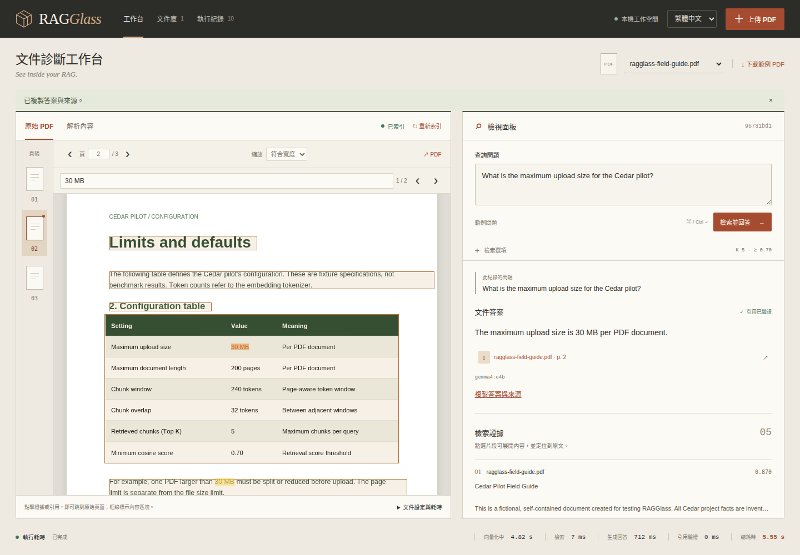

# 查詢控制、PDF 閱讀與答案匯出

[English](USABILITY.md) | **繁體中文**

這些工具讓你追蹤執行中的查詢、對照 PDF 原生文字核對答案，以及複製或匯出結果。完整流程見[圖解操作](USAGE.zh-TW.md)，安裝見[部署指南](DEPLOYMENT.zh-TW.md)。

## 追蹤或停止查詢

按下**檢索並回答**後，問題區會顯示目前階段與已等待秒數。階段依序為問題向量化、檢索、生成回答與引用驗證。計時是實際經過時間，不是預估完成百分比。模型回答期間即可查看已檢索證據；模型回應格式與引用 ID 驗證通過後才顯示答案。

按**停止查詢**送出取消要求。向量化或向量檢索期間，會等目前作業結束再停止；直到該作業結束，文件與執行紀錄都保持清理保護。生成期間取消會關閉此查詢的模型 HTTP 請求。底層推論是否停止、何時停止，由獨立模型服務決定；應用不會停止共用模型程序。

停止後紀錄顯示**已取消**，保留問題、設定、已建立的 prompt、已檢索證據與實測耗時，不含答案或引用。可在執行紀錄用**已取消**篩選；再次提問會建立新的紀錄。文件正被查詢使用時，也不能重新索引。

重新整理同一個瀏覽器分頁，會接回原本的查詢，不會另外提交問題。連線中斷會顯示重新連接提示，並恢復輪詢。關閉分頁不會取消伺服器的查詢；若要停止，先使用**停止查詢**。從歷史開啟執行中的紀錄，也會追蹤該次執行。API 正常關閉會取消進行中的非同步查詢；突然中斷時，既有重啟復原機制會將未完成紀錄標示失敗。

介面使用 `POST /api/query/start` 立即取得執行紀錄，以 `GET /api/runs/{id}` 輪詢，並透過 `POST /api/runs/{id}/cancel` 停止。既有同步 `POST /api/query` 保持腳本相容，無法透過新端點取消。工作由單一 API worker 管理，不是分散式工作佇列。

## 在原始 PDF 查找與閱讀



在**搜尋這份 PDF…**輸入文字，會搜尋所有頁面的原生文字。比對不分大小寫、正規化全形字元，並忽略文字項目或換行間的空白。搜尋範圍不包含 OCR、模型答案或 Docling chunks；純圖片頁面沒有可搜尋的原生文字。

| 操作 | 用途 |
| --- | --- |
| 搜尋箭頭／Enter／Shift+Enter | 移到下一個／上一個結果，到末端後循環。 |
| 搜尋框內 Escape | 清除搜尋與標記。 |
| 焦點在 PDF 區域時 Ctrl+F／⌘+F | 聚焦 PDF 搜尋框；其他區域仍可使用瀏覽器尋找。 |
| 縮放 | 符合寬度，或選擇 50%、75%、100%、125%、150%、200%、300%。 |
| 在 PDF 文字上拖曳 | 選取原生文字，再透過瀏覽器複製。 |

目前搜尋結果使用較深的標記。來源區塊框線仍顯示 Docling provenance，和搜尋標記分開，並非精確句子範圍。文字層與可用來源框線都隨縮放調整。手機上放大頁面會在 PDF 區域內捲動；選**符合寬度**可回到可用閱讀寬度。

## 複製或匯出答案

**複製答案與來源**會複製答案、已驗證來源的檔名與頁碼；已刪除的原檔會附標示。若瀏覽器拒絕剪貼簿權限，介面會顯示原因，提示手動選取或下載 Markdown，不會誤報成功。透過 loopback 或安全瀏覽器來源通常可使用剪貼簿。

**下載 Markdown**產生易讀報告，包含問題、答案、已驗證來源、模型／provider、檢索設定、執行狀態、可能的錯誤及實際階段耗時。PDF／模型文字會轉義為 Markdown 純文字。頁碼連結指向此工作空間，報告不內嵌 PDF；已刪除的原檔標示來源缺失，不提供檔案連結。完成、失敗或取消後皆可下載。

**下載執行 JSON**仍提供完整診斷紀錄，包括設定、prompt 與證據。匯出內容可能包含文件資訊，分享時請選擇合適目的地。引用驗證只確認引用屬於本次檢索證據，不保證每個主張的語意正確性。

## 用獨立真實服務驗證

建置目前介面，並使用已設定的模型 endpoint：

```bash
bash scripts/check.sh
.venv/bin/python scripts/verify_usability.py --browser
```

驗證器建立暫存 loopback Qdrant 容器（`qdrant/qdrant:v1.15.5`）與 API，使用獨立儲存。公開虛構 CC0 PDF 經真實 Docling／E5 處理，原 API 執行六題即時模型問答，再追蹤非同步答案、停止生成、檢查實際模型 TCP 連線拒絕，以及真正重啟 API 後的取消紀錄。Chrome 檢查搜尋、縮放、滑鼠選字、剪貼簿、Markdown、引用跳頁、語言切換與 390 像素手機視窗。另有明確標示的合成 UI 案例驗證重新連接／重新整理／取消，不進行模型推論；純文字比對與匯出契約亦屬合成測試。

只關閉、移除驗證器建立的 API／容器，並檢查原有 SQLite／文件未變動。日誌、截圖與實測紀錄留在 Git 忽略的 `.data/usability-*`。GPU 快照包含其他工作，不能視為應用獨占用量。實測結果見[里程碑紀錄](MILESTONE.zh-TW.md)。README 內嵌影片示範先前的核心流程，本指南說明新增操作工具。
