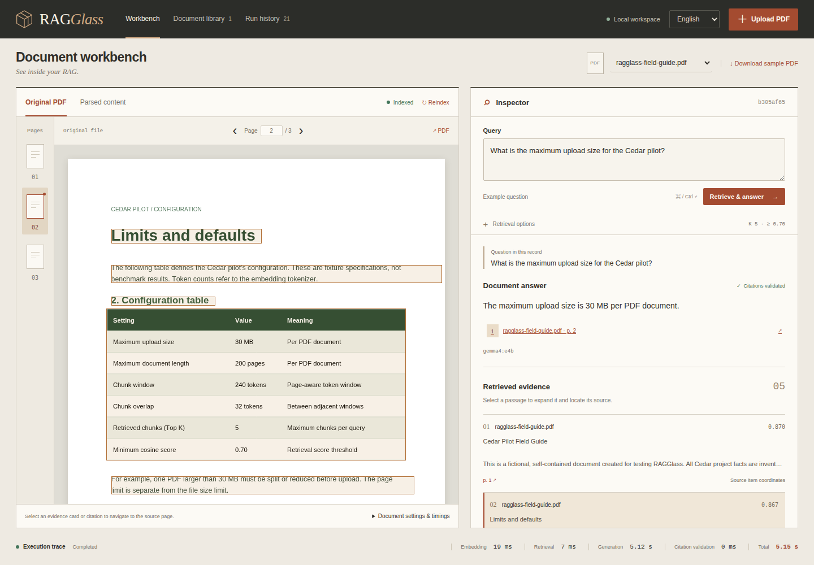
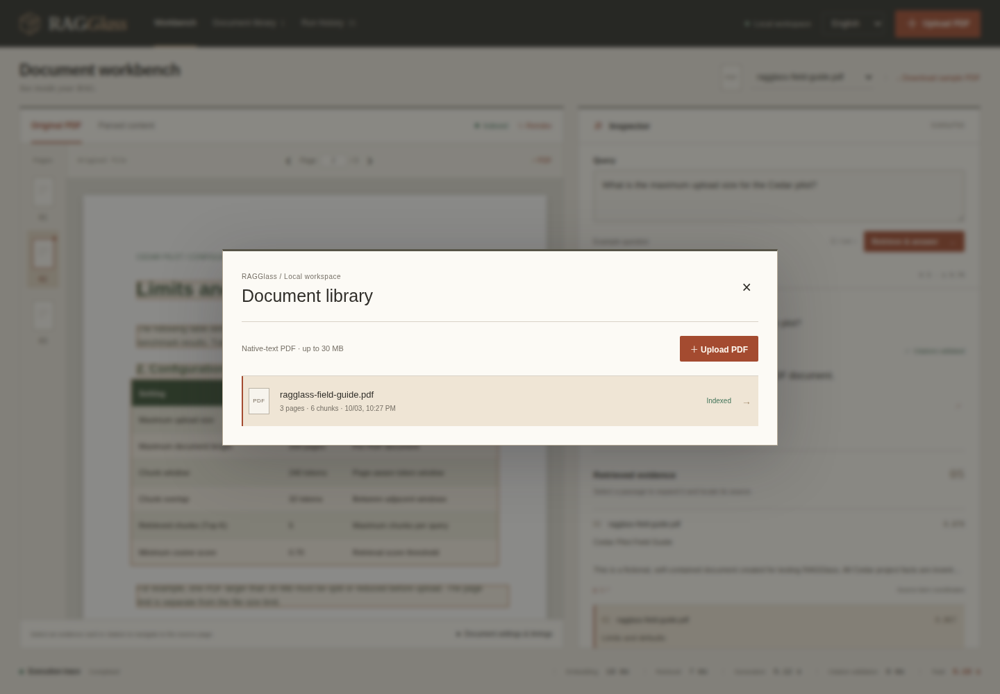
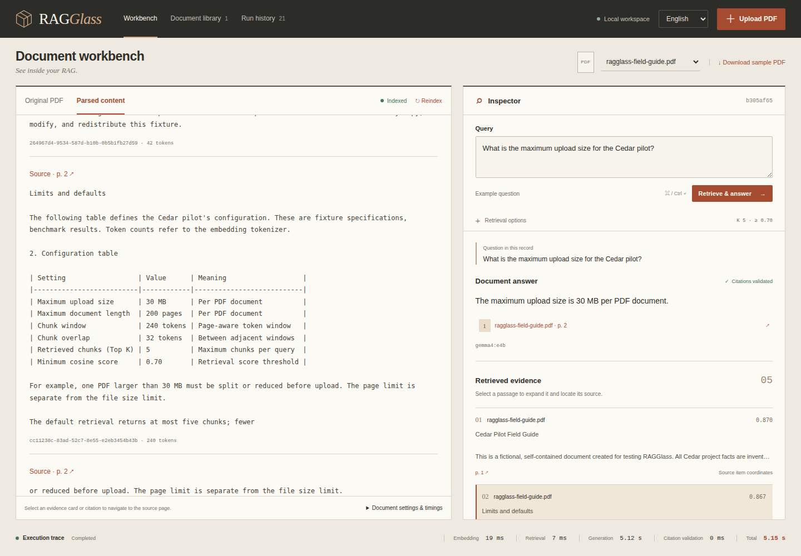
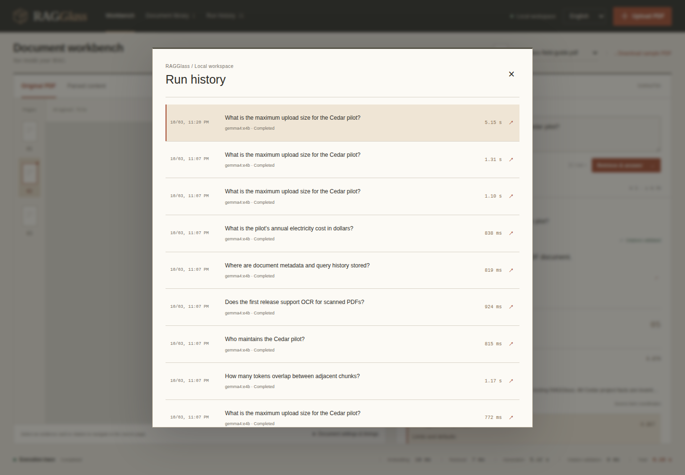
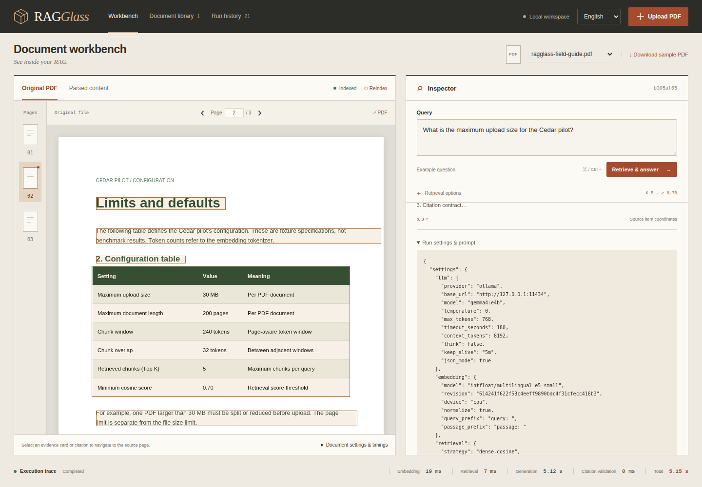

# Using RAGGlass

**English** | [繁體中文](USAGE.zh-TW.md)

RAGGlass helps document RAG engineers inspect how a PDF becomes retrieved evidence and a model answer. Use it to see whether parsing lost a table, retrieval missed a fact, or an answer cited the wrong evidence. This release exposes the evidence and run settings for your inspection; automated diagnosis and quantitative comparisons are planned.

For installation, read the [deployment guide](DEPLOYMENT.md). For model choices, see the [README](../README.md#recommended-ollama-models).

## 1. Know the workspace



This and the following images are actual captures from the built interface on 2026-10-03. They use only the original fictional CC0 sample and live `gemma4:e4b` inference. Displayed durations are measurements of those runs, not performance promises.

| Area | What you can do |
| --- | --- |
| Top navigation | Open the document library or run history; upload a PDF; change the UI language. |
| Document toolbar | Select the active document or download the original sample. |
| Left reading area | Read the original PDF, choose a page, or switch to parsed content. |
| Right inspector | Ask a question, inspect its answer, follow citations, and expand retrieved passages. |
| Bottom execution trace | Read the actual query embedding, retrieval, generation, citation-validation, and total times. |

The UI starts in Traditional Chinese. Select **English** at the top right; this preference survives reloads. On a narrow display, the PDF and inspector stack vertically. Each desktop pane can scroll independently; scroll within the inspector to reach all evidence and settings.

## 2. Upload and index a document

1. Open `http://127.0.0.1:5173` in development or `http://127.0.0.1:8000` for the built interface. These addresses refer to the machine running the app; use an SSH tunnel for another host.
2. Download the sample from the document toolbar, or use `examples/ragglass-field-guide.pdf` from your checkout.
3. Click **Upload PDF** and select the file. The default limits are **30 MB** and **200 pages**. This release accepts PDFs with selectable native text; image-only/scanned PDFs require future OCR support.
4. Watch the document badge: **Queued → Parsing → Chunking → Embedding → Indexing → Indexed**. Updates are polled every four seconds. First-time Docling/E5 downloads and initialization can take longer than subsequent uploads. The original PDF is viewable during processing.
5. Wait for **Indexed** before asking. If processing fails, read the visible error, correct the cause, and use **Reindex**. An identical PDF hash reuses its existing document record.



The **Document library** lists filename, page/chunk counts, upload date, and status. Select a row to open it, or use the document selector above the PDF. Press Escape to close a dialog; keyboard focus returns to its opener. The sample's Cedar specifications are fictional test facts, not statements about every RAGGlass deployment.

## 3. Ask a question and inspect retrieval

Click **Example question**, or type:

> What is the maximum upload size for the Cedar pilot?

Click **Retrieve & answer** or press Ctrl+Enter (⌘+Enter on macOS). With the verified configuration, the answer identifies **30 MB per PDF document**, supported by the configuration table on **page 2**. This is a live model response, so wording can vary.

Open **Retrieval options** to adjust:

| Setting | Default | Meaning |
| --- | ---: | --- |
| Top K | 5 | Maximum retrieved chunks supplied to the model; accepted range 1–12. |
| Minimum score | 0.70 | Minimum cosine similarity for evidence; accepted range 0–1. It is not a probability or answer-confidence score. |

Empty or out-of-range inputs prevent submission. If no passages pass the threshold, try a more specific question or inspect a lower threshold, then examine the evidence quality. A lower threshold can include irrelevant text. Settings that work for E5 do not automatically transfer to another embedding model.

The interface language does not translate an existing run. The prompt asks the model to answer in the **question's language**. For a Chinese answer, ask `Cedar 試用方案的上傳容量上限是多少？` rather than changing only the language selector.

## 4. Follow citations back to the PDF

Below the answer, click the source link ending in **p. 2**. The left pane switches to **Original PDF**, selects page 2, and highlights available source item boxes. You can also use the page rail, Previous/Next buttons, or page-number input. The PDF link opens the original file in a separate browser tab.

Retrieved passages show rank, filename, cosine score, and source pages. Select a passage to expand its full text and chunk ID while locating its source. Multi-page sources retain all page numbers. Missing coordinates are labeled **Coordinates unavailable**.

The backend accepts citation IDs only from that query's retrieved evidence and maps them to the document/page. **Citations validated** confirms membership and mapping; it does not prove that every claim is entailed. Compare the answer with the actual passage/table. Highlighted boxes are Docling source-item bounds, which can be broader than one quoted phrase or chunk.

## 5. Inspect parsing when evidence looks wrong



Select **Parsed content**. Every chunk includes its text, page link, token count, and full ID. Compare the extracted table with the PDF to spot missing rows, merged headers, or reading-order problems. **Markdown** and **Docling JSON** open the complete stored parse artifacts.

At the bottom of the document pane, expand **Document settings & timings** for the document ID/hash, parser configuration, chunk/embedding settings, and ingestion timings. These ingestion times are separate from the query execution trace. Reindexing runs the current parsing/chunk/embedding configuration again; historical runs keep their saved evidence/settings.

## 6. Reopen and reproduce a run



Open **Run history** at the top. Select a row to restore its question, answer, evidence, document, and retrieval options. After you edit a new question, **Question in this record** still identifies the saved result currently shown. A fresh query creates another record.



Scroll down in the inspector and expand **Run settings & prompt**. It contains parser/chunk/embedding/retrieval/model settings, document snapshots, the exact prompt, raw model response, and returned model metadata. **Download run JSON** exports the record for analysis. API keys are excluded, but uploaded text and prompts are part of a run: keep private run exports out of the public repository.

The execution trace reports actual wall-clock stages. A first model load can increase generation time; a fast run does not establish answer quality. Historical documents and runs remain after restarting the API/Qdrant with storage preserved. Model weights are not archived: also retain the evaluated weights and installed model digest as described in the README.

## 7. Try the six sample questions

| Question | Expected fact | Source |
| --- | --- | --- |
| What is the maximum upload size for the Cedar pilot? | 30 MB | Page 2 |
| How many tokens overlap between adjacent chunks? | 32 tokens | Page 2 |
| Who maintains the Cedar pilot? | Mira Chen | Page 1 |
| Does the first release support OCR for scanned PDFs? | OCR is disabled | Page 1 |
| Where are document metadata and query history stored? | SQLite | Page 1 |
| What is the pilot's annual electricity cost in dollars? | Cannot be confirmed; no citations | Not present |

The final question must express insufficient evidence. These questions are a smoke test; they do not establish reliability over arbitrary PDFs. Machine-readable questions are in [examples/questions.json](../examples/questions.json).

## 8. Verify or recapture the documentation

With the real stack running:

```bash
bash scripts/check.sh
.venv/bin/python scripts/verify_e2e.py
npm --prefix frontend run test:e2e
RAGGLASS_BASE_URL=http://127.0.0.1:8000 npm --prefix frontend run test:e2e
```

These checks distinguish synthetic contract fixtures from real parser/retrieval/model/browser evidence. Details and measured limitations are in the [milestone record](MILESTONE.md).

To regenerate the ten bilingual documentation screenshots with live inference:

```bash
node scripts/capture_ui_docs.mjs
# Optional development UI:
RAGGLASS_BASE_URL=http://127.0.0.1:5173 node scripts/capture_ui_docs.mjs
```

Use a fixture-only workspace. The script refuses capture if other documents or non-sample questions are present, uses the installed Chrome/Playwright browser, and saves measured run metadata in ignored `.data/ui-docs-capture.json`. Review every resulting image before publication. No canned answer or generated UI mockup is used.

For connection, parsing, model, and startup errors, see [deployment troubleshooting](DEPLOYMENT.md#troubleshooting). Return to the [README](../README.md).
