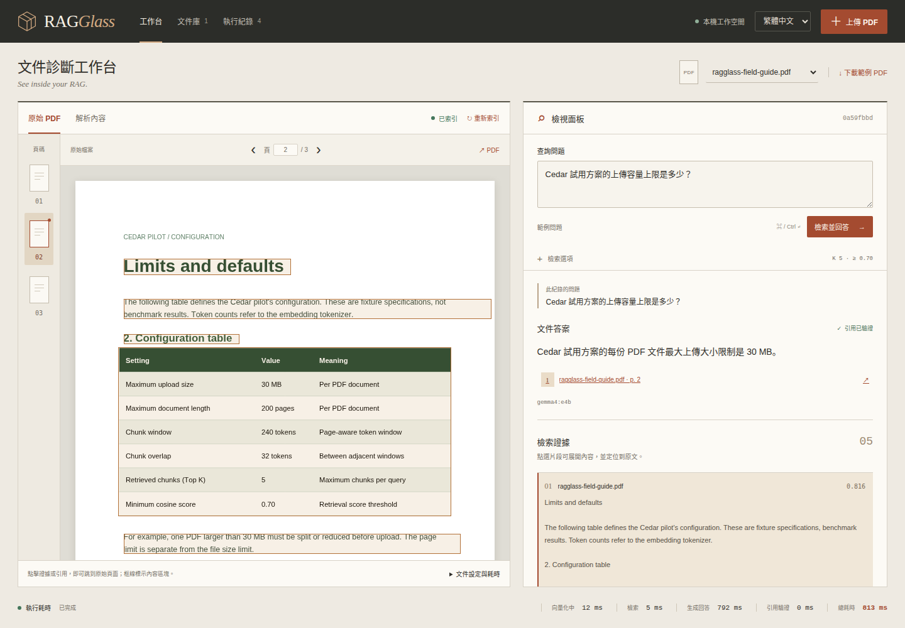
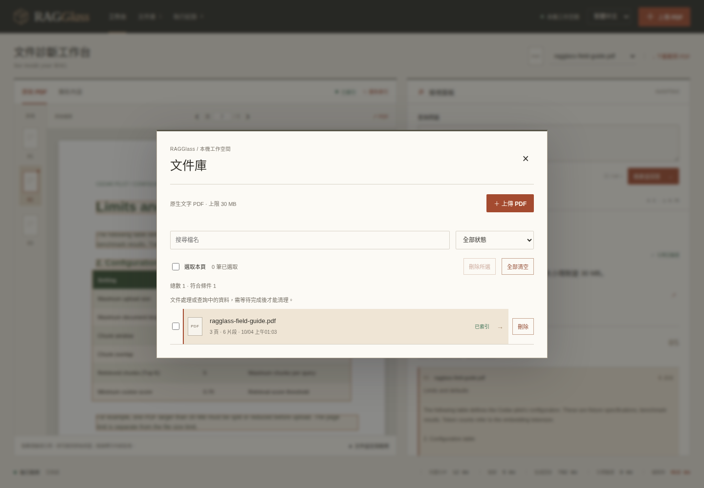
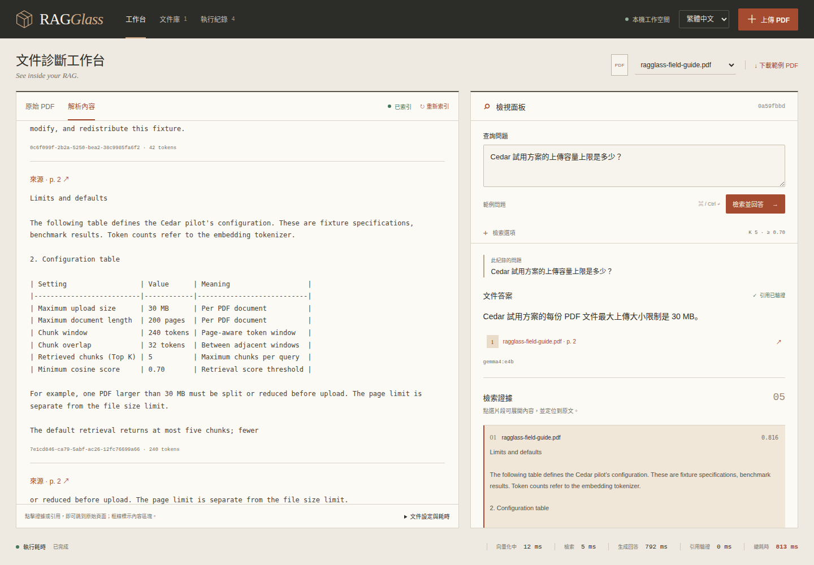
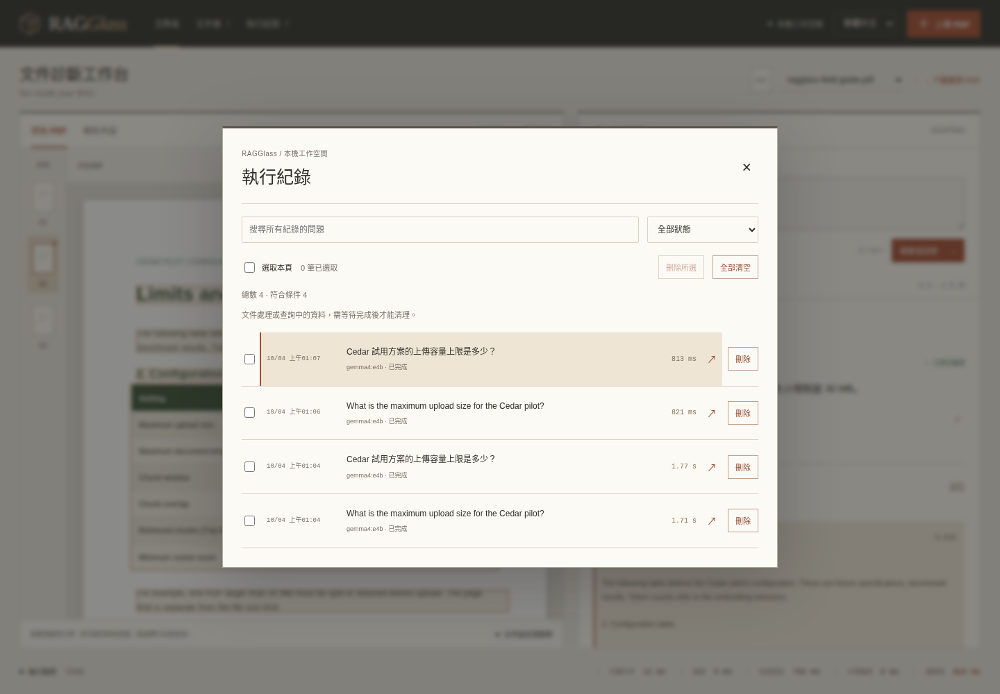
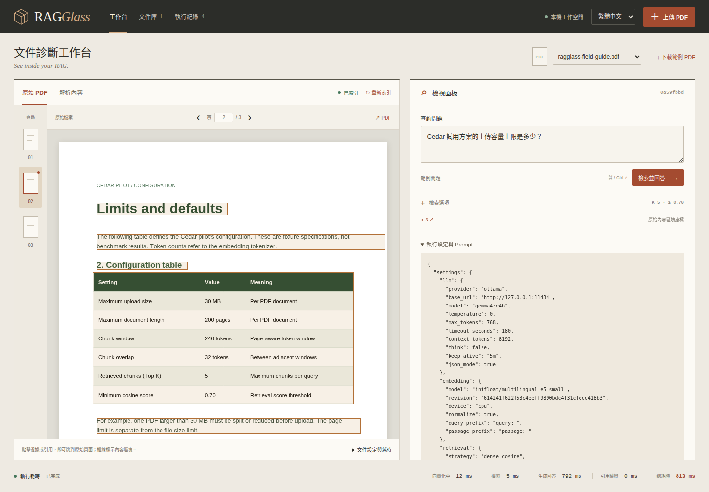

# RAGGlass 使用指南

[English](USAGE.md) | **繁體中文**

RAGGlass 讓文件 RAG 工程師看見 PDF 如何變成檢索證據與模型回答，可檢查解析是否遺失表格、檢索是否漏掉事實，或答案是否引用錯誤證據。目前提供證據與執行設定供人工追查；自動診斷與量化比較屬於後續規劃。

安裝請看[部署指南](DEPLOYMENT.zh-TW.md)，模型建議請看 [README](../README.zh-TW.md#建議的-ollama-模型)。

## 1. 認識工作台



本指南圖片於 2026-10-04（Asia/Taipei）從正式建置介面實際擷取，只使用原創虛構 CC0 範例及即時 `gemma4:e4b` 推論。圖中耗時屬於該次執行，不是效能保證。

| 區域 | 用途 |
| --- | --- |
| 頂部導覽 | 開啟文件庫／執行紀錄、上傳 PDF、切換語言。 |
| 文件工具列 | 選擇目前文件或下載原創範例。 |
| 左側閱讀區 | 查看原始 PDF、選擇頁碼、切換解析內容。 |
| 右側檢視面板 | 提問、檢查答案、點擊引用、展開檢索片段。 |
| 底部執行耗時 | 查看查詢向量化、檢索、生成、引用驗證及總耗時的實測值。 |

介面預設繁體中文，右上角可切換 English，重新整理後保留偏好。窄螢幕將 PDF 與檢視面板垂直排列；桌面兩個區域可獨立捲動，右側往下可查看完整證據與設定。

## 2. 上傳與索引文件

1. 開發版開啟 `http://127.0.0.1:5173`，正式建置版開啟 `http://127.0.0.1:8000`。地址指執行應用的機器，其他主機請使用 SSH tunnel。
2. 從工具列下載範例，或使用 checkout 中的 `examples/ragglass-field-guide.pdf`。
3. 點擊**上傳 PDF**選擇文件；預設上限 **30 MB／200 頁**。本版接受可選取原生文字的 PDF；掃描／純圖片 PDF 須等待後續 OCR 支援。
4. 查看狀態依序顯示**等待處理 → 解析中 → 切塊中 → 向量化中 → 索引中 → 已索引**，每四秒更新。首次 Docling／E5 下載與初始化通常比後續慢；處理中仍可查看原始 PDF。
5. 等**已索引**再提問。若失敗，依畫面錯誤修正後使用**重新索引**；相同 PDF hash 會重用既有文件紀錄。



**文件庫**列出檔名、頁數／片段數、上傳時間與狀態。點選資料列或 PDF 上方文件選單切換文件。Escape 可關閉對話框，焦點回到開啟按鈕。範例 Cedar 規格是虛構測試事實，不代表所有 RAGGlass 部署的設定。

## 3. 提問並檢查檢索

點擊**範例問題**，或輸入：

> Cedar 試用方案的上傳容量上限是多少？

按**檢索並回答**或 Ctrl+Enter（macOS 為 ⌘+Enter）。已驗證設定會回答每份 PDF **30 MB**，證據來自**第 2 頁**設定表格。答案即時生成，措辭可能不同。

展開**檢索選項**可調整：

| 設定 | 預設 | 意義 |
| --- | ---: | --- |
| Top K | 5 | 最多提供給模型的檢索片段，接受 1–12。 |
| 最低分數 | 0.70 | 證據最低 cosine 相似度，接受 0–1；不是機率或答案信心分數。 |

空白或超出範圍會阻止提交。若無片段通過門檻，可改寫較具體的問題或檢查較低門檻的結果，再判斷證據品質；降低門檻可能帶入不相關文字。E5 適用設定不會自動適用於其他 embedding。

切換介面語言不會翻譯既有紀錄。Prompt 要求模型以**問題的語言**回答；想要英文答案請以英文提問，而非只切換語言選單。

## 4. 從引用回到原始 PDF

點擊答案下方結尾為 **p. 2** 的來源連結。左側切回**原始 PDF**、選擇第 2 頁，並標示可用來源區塊座標。也可使用頁碼列、前／後頁按鈕或頁碼輸入框；PDF 連結可在另一個瀏覽器分頁開啟原始檔案。

檢索片段顯示排名、檔名、cosine 分數與來源頁碼。點選片段可展開全文與 chunk ID，同時定位原文；跨頁來源保留所有頁碼，缺少座標會標示**無原始座標**。

後端只接受本次檢索證據的引用 ID，並映射到文件／頁碼。**引用已驗證**代表來源存在與映射有效，不保證每句主張都有語意支持；仍須對照實際片段／表格。框線是 Docling 來源內容區塊，範圍可能大於一個引用句或 chunk。

## 5. 證據異常時檢查解析



選擇**解析內容**，每個 chunk 列出文字、來源頁碼連結、token 數及完整 ID。對照 PDF 表格可找出遺失列、合併標頭或閱讀順序問題；**Markdown** 與 **Docling JSON** 可開啟完整保存的解析產物。

文件區底部展開**文件設定與耗時**，查看文件 ID／hash、parser 設定、切塊／embedding 與文件處理耗時。這些處理耗時和查詢執行耗時分開。重新索引依目前解析／切塊／embedding 設定再處理；歷史查詢保留當時證據與設定。

## 6. 重開與重現執行紀錄



在頂部開啟**執行紀錄**，點選資料列恢復問題、答案、證據、文件與檢索選項。編輯新的問題後，**此紀錄的問題**仍標明畫面上已保存結果的問題；重新查詢會建立另一筆紀錄。



右側往下捲動並展開**執行設定與 Prompt**，包含 parser／切塊／embedding／檢索／模型設定、文件快照、確切 prompt、原始模型回應與服務回報資訊。**下載執行 JSON**可匯出分析。API key 已排除，但 run 含上傳文字與 prompt；私人執行匯出資料不要放到公開 repository。

執行耗時是實際 wall-clock，各模型第一次載入可能增加生成時間；較快不代表回答較好。保留儲存資料後重啟 API／Qdrant，文件與歷史仍可重開。系統不封存模型權重，重現時也須保留已測權重及本機模型 digest，詳見 README。

可用列表的搜尋與狀態篩選，在完整分頁歷史中查找紀錄。PDF 與執行紀錄均可單筆刪除、勾選刪除或全部清空，詳見[清理指南](CLEANUP.zh-TW.md)。

## 7. 嘗試六個範例問題

| 問題 | 預期事實 | 來源 |
| --- | --- | --- |
| Cedar 試用方案的上傳容量上限是多少？ | 30 MB | 第 2 頁 |
| 相鄰切塊重疊多少 tokens？ | 32 tokens | 第 2 頁 |
| 誰維護 Cedar 試用方案？ | Mira Chen | 第 1 頁 |
| 第一版支援掃描 PDF 的 OCR 嗎？ | OCR 已關閉 | 第 1 頁 |
| 文件 metadata 與查詢紀錄存在哪裡？ | SQLite | 第 1 頁 |
| 試用方案一年電費是多少美元？ | 無法確認，無引用 | 文件未提供 |

最後一題應表達證據不足。這些是 smoke test，不能證明任意 PDF 的可靠性；可執行的英文問題與預期結果見 [examples/questions.json](../examples/questions.json)。

## 8. 驗證與重新擷取文件圖片

真實服務運行時執行：

```bash
bash scripts/check.sh
.venv/bin/python scripts/verify_e2e.py
npm --prefix frontend run test:e2e
RAGGLASS_BASE_URL=http://127.0.0.1:8000 npm --prefix frontend run test:e2e
```

檢查明確區分合成契約輸入與真實 parser／檢索／模型／瀏覽器證據，細節及實測限制見[里程碑紀錄](MILESTONE.zh-TW.md)。

以真實推論重新擷取十張雙語操作圖片：

```bash
node scripts/capture_ui_docs.mjs
# 也可對開發介面執行：
RAGGLASS_BASE_URL=http://127.0.0.1:5173 node scripts/capture_ui_docs.mjs
```

請使用僅含公開範例的工作空間；若出現其他文件或非範例問題，程式會拒絕擷取。它使用已安裝的 Chrome／Playwright 瀏覽器，將實測 run 資訊寫入忽略的 `.data/ui-docs-capture.json`。發布前逐張檢查，不使用固定答案或生成的介面示意圖。

連線、解析、模型及啟動問題請看[部署故障排查](DEPLOYMENT.zh-TW.md#故障排查)。回到 [README](../README.zh-TW.md)。
