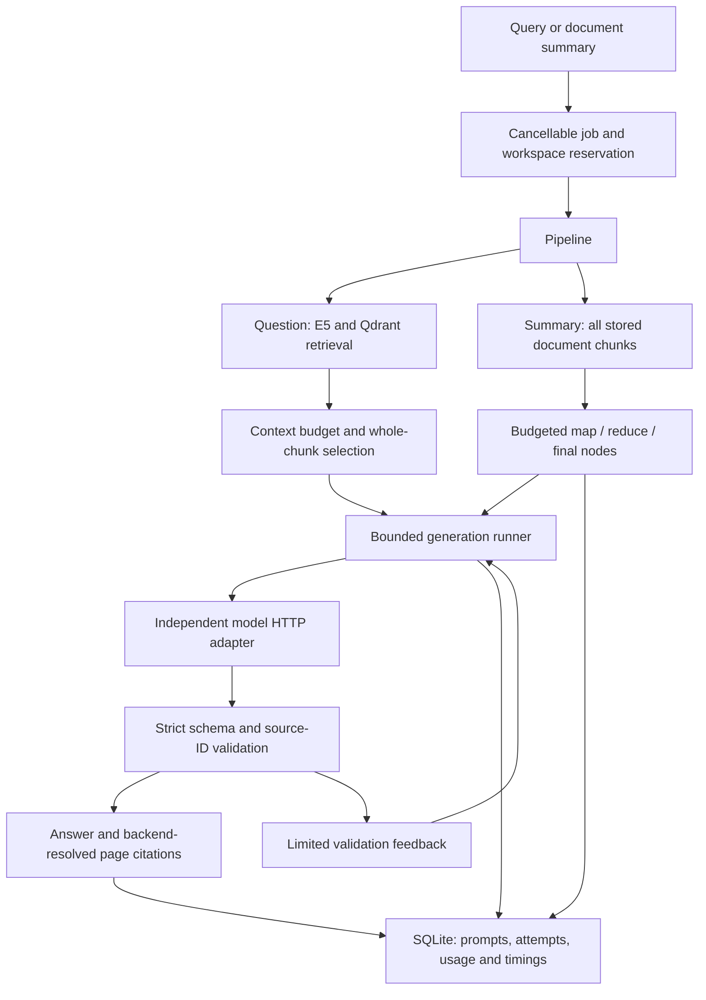

# Context, recovery and document summaries

**English** | [繁體中文](WORKFLOWS.zh-TW.md)

RAGGlass now exposes model-input budgets, bounded recovery and a fixed three-point document summary. Use the saved run to explain the engineering choices in an interview. These are implemented controls; general-purpose tool agents, fine-tuning, semantic entailment checking and GPU/SSD offloading are outside this implementation.

## Architecture and evidence



The existing parser, embedder, vector index and model adapters remain independent. Each run snapshots effective generation settings, parser/chunk/embedding provenance, retrieval settings, prompt version and recovery policy. History lists omit large prompts, raw completions, attempts and workflow nodes; the detail endpoint and JSON download retain them. A restart marks unfinished runs/nodes/attempts as interrupted. Completed or cancelled traces survive reopening.

## Use the controls

1. Upload a native-text PDF and wait until it is indexed.
2. Open **Generation options**. Set Temperature, Top-P and output-token limit, or choose a phrasing preset. Precise phrasing uses `T=0, P=1`; varied phrasing uses `T=0.8, P=1`. Presets change wording and still require evidence. Values are recorded per run and restored from history without changing other queries' defaults.
3. Ask a question normally. **Context & model calls** shows estimated input, reserved output, included/excluded chunks and native model-reported usage. Excluded chunks remain visible and cannot support accepted citations.
4. Choose **Summarize document in 3 points** to summarize every stored chunk in the selected document, independent of Top-K and retrieval threshold. Each point has source IDs in `summary_points`; the answer card provides resolved PDF/page buttons.
5. Expand model calls and summary steps to inspect inputs, outputs, failures and measured times. Stop a running query or summary using the existing stop button. Export JSON for the complete trace, or Markdown for a compact answer/usage report.

## Context and tokens

`utf8-bytes-plus-framing-v1` counts the UTF-8 bytes of serialized messages **and schema**, plus 128 units for framing. Planning also reserves requested output, `LLM_CONTEXT_MARGIN` and 256 units for repair feedback when repairs are enabled. Whole ranked chunks are selected; the original evidence is retained. If no complete chunk fits, the run fails visibly before inference. Summary batches partition all input chunks without clipping text or silently dropping a source.

This is a deliberately conservative **estimate**, not the Gemma tokenizer and not a universal guarantee for custom server templates or hidden reasoning. Chinese and English do not have a fixed character-to-token ratio. E5 token counts only size embedding chunks. After each model call, Ollama's `prompt_eval_count` / `eval_count` or the compatible API's usage counters are saved separately. An estimate/native reservation mismatch is flagged in the trace. Exact preflight counting would require a verified tokenizer and chat template matching the served model. The independent estimator module leaves that extension possible.

Usage totals include reported tokens from failed validation attempts, successful retries and all summary nodes. Failed/cancelled calls without complete usage are counted as **unknown**, not free. For an API billed per million tokens, `input_tokens × input_rate / 1,000,000 + output_tokens × output_rate / 1,000,000` is a basic cost calculation; caching and provider billing need their own rules. Local Ollama has hardware, power and operating costs; these counters are not a monetary bill or an energy measurement.

## Bounded recovery

Default policy: at most **3 attempts per node**, **1 schema/citation repair per node**, **32 model calls per run**, and a **600-second workflow deadline** checked before model calls. Waiting HTTP calls are bounded by the remaining deadline and the configured 180-second request timeout; an already running CPU/vector operation still returns safely. Transient transport errors and HTTP 429/500/502/503/504 can retry with exponential backoff and jitter. HTTP 401/404 and other permanent HTTP errors fail immediately. Model generation has no external write side effects; this policy must not be copied blindly to payment, email or other future tools. Query/summary requests reject unknown fields; clients that previously sent ignored extras must remove them.

Invalid model JSON or foreign source IDs can trigger one new generation with concise validation feedback. The invalid completion is retained in history but never appended to the repair prompt. Repairs are budget-checked again and use the same permitted evidence. Every attempt is recorded before the request, including reason, prompt, result/error, timing and available usage. Repair exhaustion produces a failed run with no answer. Schema validation and citation membership do **not** establish factual entailment or eliminate prompt injection; verify the actual document.

Cancellation closes the application HTTP await and stops backoff/future nodes. It does not promise cancellation of the model server's GPU computation. An in-flight CPU/vector stage keeps its workspace reservation until it returns safely. Final answer/citation display is suppressed on cancellation.

## Long document summary

The summary is a fixed workflow rather than an autonomous tool agent. `map` nodes read disjoint whole-chunk batches and produce up to three concise notes with source IDs. Document IDs/page metadata accompany original chunks, and document IDs accompany compacted notes to preserve source grouping. If all notes do not fit, `reduce` nodes compact them hierarchically. A `final` node returns exactly three cited points or a structured refusal. Every node can cite only IDs carried by its own input, even if another node has seen a different chunk. Original chunks, prompts, notes and links remain in the saved run. Generation time includes retries, validation and summary orchestration; nested node/validation timings should not be summed with that parent time.

The full document must fit within call/time limits; reaching a limit or failing to compact stops the workflow visibly. Dates, amounts, names and requested actions are prompt requirements, not formally proven invariants. Mapping every chunk proves input coverage, not retention of every fact. Human review and larger annotated summary evaluations remain necessary. Reading all stored chunks still uses document-sized application memory; vector batching does not make parsing or summary source loading fully streaming.

## Repeatable evaluation

The [fictional CC0 field guide](../examples/ragglass-field-guide.pdf) has a [12-case English/Chinese annotation set](../examples/evaluation-cases.json): ten answerable questions and two unanswerable questions. With an indexed copy and a running local API:

```bash
.venv/bin/python scripts/evaluate.py --document-id YOUR_DOCUMENT_ID --output .data/baseline.json
.venv/bin/python scripts/evaluate.py --document-id YOUR_DOCUMENT_ID --temperature 0.8 --compare .data/baseline.json --output .data/varied.json
```

The script measures gold-page recall and first-gold-page MRR at the selected K, gold-page citation coverage, literal expected-text matches, refusal counts, median/p95 query latency and reported/unknown token usage. It retains the dataset/document hashes and settings. Default generation comparisons require matching annotations, document/stored-chunk hashes, parser/chunk/embedding/retrieval settings, context/recovery settings and prompt version. Generation settings can differ and are shown as the treatment. Exact token usage is service-reported, and latency includes retries and shared-workload effects. Twelve small cases are a smoke dataset, not a production accuracy estimate; substring matches are not a semantic judge. A separate [16-case retrieval lab](RETRIEVAL.md#evaluate-one-treatment) compares vector, BM25 and hybrid modes with `--compare-axis retrieval`; it keeps generation and all non-mode retrieval settings fixed and reports candidate traces, category slices and retrieval latency.

Run `bash scripts/check.sh` for synthetic contracts and the frontend build. Run `.venv/bin/python scripts/verify_workflows.py` for the isolated real Docling/E5/Qdrant/Ollama stack, fictional long complaint, bilingual evaluation, actual cancellation/restart and built Chrome flows. The latter owns disposable loopback services/storage, verifies the owner's documents/SQLite are unchanged, and removes only its services. Reports and full traces stay in ignored `.data/workflows-verification.json` and `.data/workflows-evaluation.json`. See [measured milestone](MILESTONE.md) for actual results.

## Interview questions tied to the project

| Question | Implementation to demonstrate | Boundary to state |
| --- | --- | --- |
| How do you manage a growing context window? | Whole-chunk budget selection; map/reduce summaries; stored originals and per-node notes. | Fixed workflows, not general conversation memory; preflight is estimated. |
| How do you handle API timeout/error and self-correction? | Retry classification, backoff, attempt/time/call caps, cancellation and schema/source-ID feedback. | Strict API request validation rejects extra parameters; no general tool-call repair agent. |
| How would you set Temperature / Top-P for writing vs JSON? | Per-run controls and phrasing presets; native schema plus backend validation. | Low T helps consistency but guarantees neither syntax nor facts; compare one sampling control at a time. |
| Fine-tuning or RAG for detailed laws and lawyer-like tone? | RAG supplies chosen PDF knowledge and sources; prompts/generation options control style; replaceable model endpoint permits a separately tuned model later. | No fine-tuning or legal validity/recency verification has been implemented. |
| Turn a long complaint into three key points. | Full-document map/reduce/final workflow, exactly three structured points, per-node provenance and page navigation. | Compression may lose meaning; inspect dates, money and requested actions against the original. |
| How many tokens are Chinese/English characters; how much does a request cost? | Show UTF-8 estimate beside model-native input/output and all attempts' usage. | E5 and the answer model tokenize differently; unknown usage and local operating cost are not zero. |
| Why build this project and choose this architecture/storage? | Show original PDF → Docling → E5/Qdrant → selected evidence → model → validated citations; SQLite is trace/history truth. | Native-text vector/BM25/RRF adapters; OCR and reranking remain future work. |
| Why hybrid retrieval and how are scores combined? | Show distinct cosine/BM25 candidates and RRF ranks; run fixed-condition [mode comparisons](RETRIEVAL.md). | BM25 scans selected chunks, RRF is not a confidence score, and quality gains are not universal. |
| Why these chunk sizes, overlap, K and score threshold? | Recorded chunk settings, retrieval controls and annotated gold-page evaluation. | E5 overlap is not LLM budgeting; cosine score is not answer confidence. |
| How do you diagnose a wrong answer or evaluate a change? | Compare parsing, retrieval, selected context, attempts and citations; run the bilingual evaluation with hashes/settings. | Source membership and keyword scores do not prove entailment or broad accuracy. |
| What limits memory, latency and resource usage? | Bounded vector batches and model input, per-stage/attempt timers, deadline and call caps. | No isolated VRAM/energy benchmark, multi-user queue/ACL, SSD KV cache offload or aiDAPTIV integration. |

A concise explanation: “I separated retrieval, context planning, model calls and validation. The system retains source chunks and all attempts, limits model input and retry loops, and produces document summaries through traceable steps. I can show actual native token usage and fixture measurements, and I distinguish source-ID validation from semantic correctness.”

The model adapter follows [Ollama's chat API](https://docs.ollama.com/api/chat), [structured output guidance](https://docs.ollama.com/capabilities/structured-outputs) and [generation option reference](https://docs.ollama.com/modelfile). The OpenAI-compatible adapter has synthetic HTTP contract coverage; live evidence in this milestone uses Ollama.
