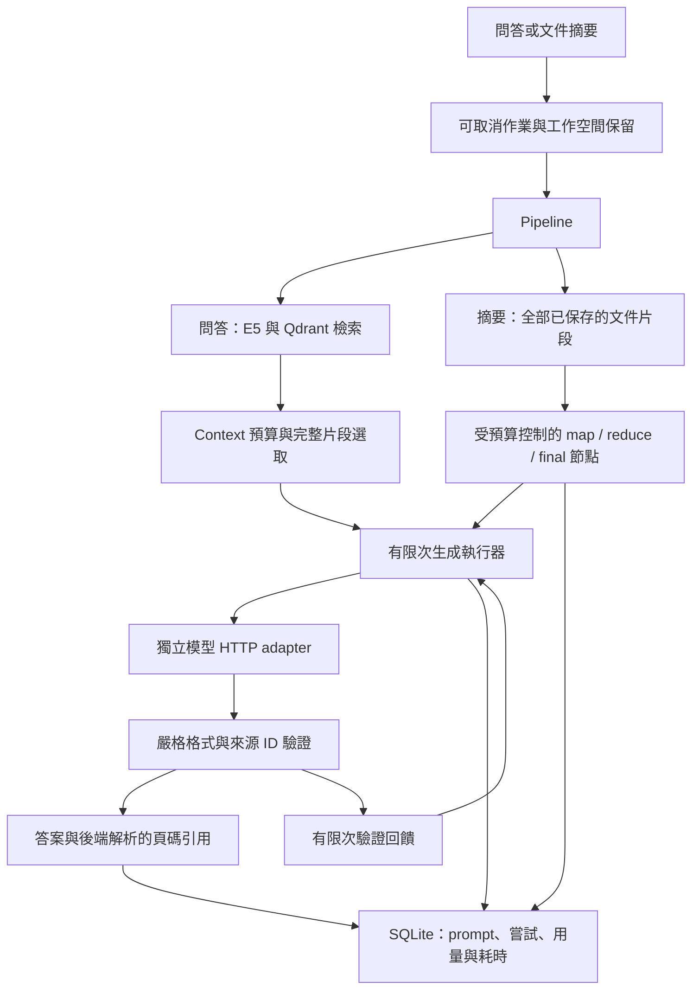

# Context、錯誤恢復與文件摘要

[English](WORKFLOWS.md) | **繁體中文**

RAGGlass 現在提供模型輸入預算、有次數限制的錯誤恢復，以及固定的文件三點摘要流程。面試時可直接用保存的執行紀錄說明工程選擇。這些是已實作的控制；通用工具 Agent、Fine-tuning、語意蘊含驗證與 GPU／SSD offloading 不在這次實作範圍。

## 架構與證據



既有 parser、embedder、vector index 與模型 adapter 維持獨立。每次執行保存實際生成參數、parser／chunk／embedding 設定、檢索參數、prompt 版本與恢復策略。歷史列表不傳輸大型 prompt、原始模型輸出、嘗試和流程節點；詳細 API 與 JSON 下載保留完整內容。重啟時將未完成的執行、節點與呼叫標記為中斷，已完成或取消的紀錄可重新開啟。

## 操作方式

1. 上傳原生文字 PDF，等待完成索引。
2. 展開 **模型生成參數**，調整 Temperature、Top-P 與輸出 token 上限，或使用表達預設值。精確表達為 `T=0、P=1`，多樣表達為 `T=0.8、P=1`。預設值影響表達，回答仍需要證據。參數依執行保存，從歷史重開會恢復，且不改變其他查詢的預設值。
3. 正常提問。**Context 與模型呼叫** 顯示估算輸入、輸出保留、納入／排除片段，以及模型實際回報用量。被排除的片段仍可檢查，但不能成為通過驗證的引用。
4. 按 **三點文件摘要**，處理目前文件全部已保存的片段，不受 Top-K 或檢索門檻影響。每點的來源 ID 保存在 `summary_points`，答案卡提供後端解析的 PDF／頁碼按鈕。
5. 展開模型呼叫與摘要步驟，檢查輸入、輸出、失敗和實測耗時。沿用停止按鈕取消問答或摘要。JSON 可下載完整紀錄；Markdown 提供精簡答案與用量報告。

## Context 與 token

`utf8-bytes-plus-framing-v1` 計算序列化訊息與 **schema** 的 UTF-8 bytes，再加 128 單位的訊息格式預留。規劃時另外保留要求的輸出、`LLM_CONTEXT_MARGIN`，以及啟用修正時的 256 單位回饋空間。只選取完整的排序片段，保留原始檢索證據；沒有完整片段能放入時，推論前就明確失敗。摘要批次涵蓋所有輸入片段，不截斷文字或默默跳過來源。

這是刻意保守的 **估算**，不是 Gemma tokenizer，也不保證所有自訂模型模板或隱藏推理都適用。中文、英文沒有固定的字數轉 token 比率；E5 token 數只用來限制 embedding 切塊。每次模型呼叫後，另行保存 Ollama 的 `prompt_eval_count`／`eval_count` 或相容 API 用量。若模型實際回報超出事前保留額度，紀錄會顯示提示。精確的事前計數需要驗證 tokenizer 與 chat template 確實對應目前服務模型；獨立的估算模組可供後續替換。

總用量包含格式驗證失敗的輸出、成功重試與所有摘要節點。失敗／取消呼叫未完整回報的用量標示 **未知**，不當成免費。若 API 依百萬 token 計價，基本公式是 `輸入 token × 輸入單價 ÷ 1,000,000 + 輸出 token × 輸出單價 ÷ 1,000,000`；快取與實際計費仍需遵循供應商規則。本機 Ollama 有硬體、電力和維運成本；這些 token 計數不是金額帳單，也不是耗電實測。

## 有限次錯誤恢復

預設每節點最多 **3 次嘗試、1 次格式／引用修正**，每次執行最多 **32 次模型呼叫**，並在模型呼叫前檢查 **600 秒流程截止時間**。等待中的 HTTP 呼叫受剩餘時間與預設 180 秒 request timeout 限制；已在執行的 CPU／向量操作仍會安全返回。暫時性傳輸錯誤，以及 HTTP 429／500／502／503／504，可採指數退避與隨機延遲重試；HTTP 401／404 等永久錯誤立即失敗。生成操作沒有外部寫入副作用，未來若加入付款、郵件或其他工具，不能直接照搬重試策略。問答／摘要請求會拒絕未知欄位，先前傳送被忽略多餘欄位的用戶端需移除它們。

無效模型 JSON 或外來來源 ID，可觸發一次帶精簡驗證回饋的新生成。錯誤輸出保留在歷史，但不加入修正 prompt；修正再次檢查預算，並沿用同一組允許的證據。每次呼叫送出前就保存原因、prompt、結果／錯誤、耗時和可取得的用量。修正耗盡後以失敗結束，不顯示答案。格式與引用 ID 成員驗證 **不等於** 事實蘊含檢查，也無法完全排除 prompt injection，仍需核對原文。

取消會關閉應用程式的 HTTP await，停止退避等待與後續節點；不保證模型伺服器已停止 GPU 計算。執行中的 CPU／向量步驟會持續保留工作空間，等安全返回後停止。取消不顯示最終答案或引用。

## 長文件摘要

摘要採固定流程，不是自主工具 Agent。`map` 節點讀取互不重複的完整片段批次，產生最多三條精簡筆記與來源 ID。原始片段攜帶文件 ID／頁碼，壓縮筆記也保留文件 ID，以維持來源分組。筆記仍放不下時，由 `reduce` 節點逐層壓縮，最後 `final` 節點回傳恰好三條有引用的重點，或結構化拒答。每個節點只能引用自身輸入攜帶的 ID，即使其他節點看過另一個片段也不能越界。原始片段、prompt、筆記與連結保存在執行紀錄。生成耗時包含重試、驗證與摘要流程管理，內層節點／驗證耗時不能再與這個外層時間相加。

整份文件必須在呼叫／時間限制內完成，達上限或無法縮短 context 時明確停止。保留日期、金額、姓名與要求的行動是 prompt 要求，不是已證明的語意不變量。所有片段都有進入 map，只能證明輸入覆蓋，不能證明保留了每個事實；仍需人工與更大的標註摘要資料集驗證。讀取全部片段仍使用與文件大小相關的應用程式記憶體，向量批次不代表 parser 或摘要來源載入已完全串流化。

## 可重複評測

[虛構 CC0 範例 PDF](../examples/ragglass-field-guide.pdf) 搭配 [12 題中英文標註資料](../examples/evaluation-cases.json)，包含十題可回答與兩題不可回答。在已索引該文件、啟動本機 API 後執行：

```bash
.venv/bin/python scripts/evaluate.py --document-id YOUR_DOCUMENT_ID --output .data/baseline.json
.venv/bin/python scripts/evaluate.py --document-id YOUR_DOCUMENT_ID --temperature 0.8 --compare .data/baseline.json --output .data/varied.json
```

腳本計算指定 K 下的標註來源頁 recall、標註頁引用覆蓋、預期文字比對、拒答數、查詢 median／p95 耗時，以及已回報／未知 token 用量，保存資料集與文件 hash、設定。比較時要求標註、文件、parser／chunk／embedding／retrieval 設定和 prompt 版本相同；生成參數可不同，並顯示比較條件。精確 token 用量由服務回報；耗時包含重試，也受共用工作負載影響。十二題是小型 smoke 資料集，不是正式環境準確率；子字串比對也不是語意裁判。

`bash scripts/check.sh` 執行合成契約測試與前端建置；`.venv/bin/python scripts/verify_workflows.py` 驗證隔離的真實 Docling／E5／Qdrant／Ollama、虛構長客訴、中英文評測、實際取消／重啟與建置版 Chrome 流程。後者建立暫時的 loopback 服務與儲存空間，檢查擁有者文件／SQLite 沒有改變，只移除自己的服務。報告與完整紀錄保存在忽略版控的 `.data/workflows-verification.json`、`.data/workflows-evaluation.json`。實測結果見 [里程碑](MILESTONE.zh-TW.md)。

## 面試題與專案對照

| 問題 | 可操作的實作證據 | 要誠實說明的邊界 |
| --- | --- | --- |
| 多步驟流程的 context 越來越長，如何管理？ | 完整片段的預算選取、map／reduce 摘要、保存原文與每個節點筆記。 | 固定流程，尚未實作通用對話記憶；事前 token 是估算。 |
| API timeout／error 與 self-correction 怎麼做？ | 重試分類、退避、次數／時間／總呼叫上限、取消及格式／來源 ID 回饋。 | 嚴格 API 參數驗證可拒絕多餘欄位；尚無通用工具呼叫自我修正 Agent。 |
| 文案與固定 JSON 的 Temperature／Top-P 如何設？ | 每次執行參數、表達預設值、原生 schema 與後端驗證。 | 低 T 不能保證格式或事實；比較時先一次改一個採樣控制。 |
| 法律細節與律師語氣選 FT 還是 RAG？ | RAG 提供選定 PDF 的知識與來源，prompt／參數控制表達，可替換的模型端點容許未來接入另行微調的模型。 | 尚未實作 Fine-tuning，也沒有法律效力／時效驗證。 |
| 長篇客訴轉成三點重點。 | 全文 map／reduce／final、三條結構化重點、每個節點的來源與 PDF 頁碼跳轉。 | 壓縮可能遺失語意；日期、金額、要求的處置仍要對照原文。 |
| 中英文多少字是幾個 token，會花多少？ | 事前 UTF-8 估算與模型實際輸入／輸出，以及全部嘗試用量並列。 | E5 與回答模型分詞不同，未知用量與本機維運成本不等於零。 |
| 為什麼做這個專案，架構與儲存怎麼選？ | 原始 PDF → Docling → E5／Qdrant → 選取證據 → 模型 → 引用驗證，SQLite 保存追溯／歷史。 | 原生文字、dense retrieval 基線；OCR、hybrid 與 reranking 待擴充。 |
| 為什麼用這個 chunk、overlap、K 與門檻？ | 保存的切塊設定、檢索控制與標註來源頁評測。 | E5 overlap 不是 LLM 預算，cosine score 不是答案信心。 |
| 回答錯誤怎麼查、改動怎麼評估？ | 逐層比較 parsing、檢索、選取 context、嘗試與引用，使用帶 hash／設定的中英文評測。 | 來源 ID 和關鍵字分數不能證明語意蘊含或一般準確率。 |
| 記憶體、延遲與資源怎麼控制？ | 有界向量批次、模型輸入預算、每階段／呼叫耗時、時間與呼叫上限。 | 沒有隔離 VRAM／耗電 benchmark、多使用者 queue／ACL、SSD KV cache offload 或 aiDAPTIV 整合。 |

口述範例：「我把檢索、context 規劃、模型呼叫和驗證拆開。系統保留原始片段與每次嘗試，限制模型輸入和重試迴圈，透過可追溯的步驟完成文件摘要。我可以展示模型實際 token 用量與範例實測，並清楚區分引用 ID 驗證和語意正確性。」

模型 adapter 依循 [Ollama chat API](https://docs.ollama.com/api/chat)、[結構化輸出說明](https://docs.ollama.com/capabilities/structured-outputs) 與 [生成參數參考](https://docs.ollama.com/modelfile)。OpenAI 相容 adapter 採合成 HTTP 契約驗證，本里程碑的真實模型證據使用 Ollama。
